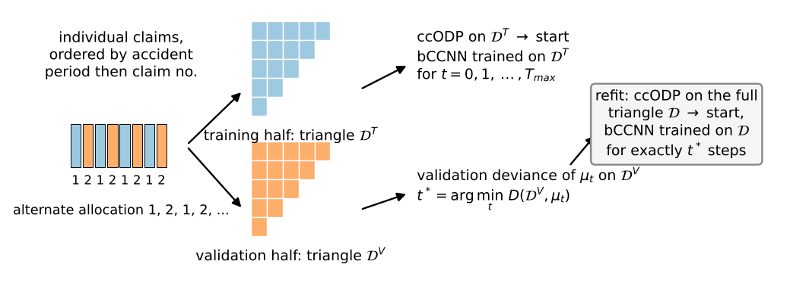

# Notation used in this document {-}

The symbols are those of the companion explainer *The mathematics behind the bCCNN: the ccODP model, the network and its chain-ladder start* (cited below as "the companion"); the ones in the lower block are new here.

| Symbol | Meaning | Section |
|:--|:--|--:|
| $n$ | accident periods = development periods, $n = 20$ | 2 |
| $i, j, k$ | accident period, development period (both $1, \dots, n$), calendar period $k = i + j - 1$ | 2 |
| $\mathcal{O}, \mathcal{F}$ | observed cells ($i + j \le n + 1$, 210 of them) and future cells (190) | 2 |
| $Y_{i,j}, y_{i,j}$ | incremental payments of a cell, in millions | 2 |
| $c, \alpha_i, \beta_j$; $\hat c, \hat\alpha, \hat\beta$ | ccODP parameters and their MLE | 3 |
| $D(\boldsymbol y, \boldsymbol\mu; \mathcal{S})$ | Poisson deviance on the cells $\mathcal{S}$, companion eq. (7) | 4 |
| $\theta, \theta_0$ | the 547 trainable parameters; the start of gradient descent, companion eq. (26) | 4 |
| $\mu_{i,j}(\theta)$ | the network's mean, companion eq. (24) | 4 |
| $\ell(\theta)$ | the loss Keras minimises, companion eq. (27) | 4 |
| $\eta, \rho, \epsilon$ | RMSprop learning rate, decay, stabiliser: $0.001$, $0.9$, $10^{-7}$ | 5 |
| $\hat R$ | reserve, the sum of the means over $\mathcal{F}$ | 9 |
| | New in this document | |
| $\mathcal{D}$ | the observed triangle of the whole portfolio (`sets$upper`), the training data of the final fit | 2 |
| $\mathcal{D}^{T}, \mathcal{D}^{V}$ | observed triangles of the training half and of the validation half of the claims (`sets$train`, `sets$vali`) | 3 |
| $y^{T}_{i,j}, y^{V}_{i,j}$ | their cells | 3 |
| $\mathcal{T}$ | the test set: the true lower triangle (`sets$test`) | 2, 10 |
| $N$ | number of cells the network is trained on: 210 for $\mathcal{D}$ and for $\mathcal{D}^{T}$ | 4 |
| $s$ | the seed (`cfg$seed` = 2026) | 6 |
| $t, \theta_t$ | gradient-descent step $0, 1, 2, \dots$ (= Keras epoch, full batch); the parameters after step $t$ | 4 |
| $T_{\max}$ | length of the early-stopping run, `max_epochs` = 1000 | 7 |
| $D_T(t), D_V(t)$ | deviance of $\mu(\theta_t)$ on the training cells and on the validation cells, without dropout | 7 |
| $\ell^{\mathrm{drop}}_t$ | the loss Keras reports for epoch $t$ (with dropout, before that epoch's update) | 7 |
| $t^*$ | the step with the lowest validation deviance; the number of steps of the final fit | 7 |
| $\Delta_T, \Delta_V, \Delta_T^{\mathrm{drop}}$ | relative decreases of the losses from the start to $t^*$ (Paper C Table 3) | 7.4 |
| $v_t$ | RMSprop's running mean of squared gradients | 5 |
| $\mathcal{T}^{s}_{t}(\theta, \mathcal{S})$ | the map "$t$ RMSprop steps with seed $s$ on the cells $\mathcal{S}$, from $\theta$" | 11 |

Abbreviations: ccODP, cross-classified over-dispersed Poisson; bCCNN, blended cross-classified neural network; CL, chain ladder; LoB, line of business. "Paper C" is Gabrielli, Richman and Wüthrich (2020); "Härkönen" is Härkönen (2021), the master thesis you supplied; "Al-Mudafer et al." is Al-Mudafer, Avanzi, Taylor and Wong (2021). Quotations from Paper C and Al-Mudafer et al. are taken from your hyperparameter notes (`thesis/Hyperparameter search`), which cite them by PDF page; I have not re-read those two papers for this document.

# What this document covers

The companion describes the model, the loss, the gradients and the start. This document describes the procedure around them: which data the ccODP and the network are fitted on, which data decide when the gradient descent stops, which data are held back to judge the result, what the optimiser does at each step, what is random, and what the fitted network is therefore a function of. It follows `bccnn_calibrate()` and the functions it calls, step by step, and writes each step as a formula. The default procedure in `config.yml` chooses the number of steps on rolling-origin partitions (`validation: rolling_origin`); that split is described in full in the companion *The time-aware split for the bCCNN*, and here it enters only where it plugs into the same procedure (Section 7.5). The alternative, Paper C's 50/50 split of the claims (`validation: claims_split`), is described in full here (Section 3), because it is the procedure of the two papers you supplied.

**How the procedure was checked.** The procedure of Sections 3 to 9 was run in plain numpy (no Keras) on a synthetic portfolio built as two independent halves with the dimensions of your data, with Keras's RMSprop rule and inverted dropout re-implemented from their definitions. Section 14 reports the run: the two halves' ccODP parameters relate as Section 3.2 predicts, the validation curve has an interior minimum, and the refit reproduces the bookkeeping of `bccnn_calibrate()` and `bccnn_tables()` row by row.

# The data and its three parts

`triangle_sets(transactions, n_dev = 20, claims)` turns the simulator's payment transactions into $20 \times 20$ incremental squares (rows = accident years, columns = development years $1, \dots, 20$; payments after development year 20 are left out, see the companion, Section 2). The script writes five of them to `data/interim`. For the procedure they form three parts:

| part | matrix | cells | used for |
|:--|:--|:--|:--|
| the observed triangle $\mathcal{D}$ | `sets$upper` | $\mathcal{O}$, 210 cells; future cells `NA` | the ccODP of the final fit and the training of the final network (Section 8); the in-sample loss (Section 9) |
| the two halves $\mathcal{D}^{T}, \mathcal{D}^{V}$ | `sets$train`, `sets$vali` | $\mathcal{O}$ each | choosing $t^*$ under `claims_split` (Sections 3, 7); never used by the final fit |
| the test set $\mathcal{T}$ | `sets$test` | $\mathcal{F}$, 190 cells; observed cells `NA` | the back-test only: the true reserves and the out-of-sample loss (Section 10); never used to fit or to choose $t^*$ |

Table 1: The parts of the data. Under `rolling_origin` the halves are not used; the partitions are cut out of $\mathcal{D}$ instead (companion on the time-aware split).

All amounts are divided by $u = 10^6$ (`dat_cfg$scale`) before anything is fitted; the companion (Section 3.8) shows that this only shifts the ccODP intercept.

# The 50/50 split of the claims (Paper C, Section 3.3.1 and Listing 2)

## Definition

The upper triangle has 210 cells and the ccODP needs every accident period and every development period to have cells, so holding back cells of $\mathcal{D}$ for validation is not an option in Paper C's view: "one of the reasons being that we only have $(I+1)I/2 = 78$ observations in the upper triangle" (Paper C, §3.3.1, on their $12 \times 12$ triangles). The split is made one level below the triangle, on the individual claims: "we choose training and validation sets by partitioning on the individual claims level such that both sets have (approximately) the same size (on a LoB level and on an accident year level)" (Paper C, §3.3.1). Härkönen does the same: "we have divided the individual claims data into training and validation data that are approximately the same size (50/50) since the model parameters from the ODP model are sensitive to the volume of the data and these are the input weight to our neural network models" (Härkönen, §3.1).

`triangle_sets()` implements Paper C's Listing 2. Order the claims by accident period and, within it, by claim number; allocate them alternately,

$$
h(\text{claim } r) = 1 + \big( (r - 1) \bmod 2 \big) \in \{1, 2\}, \qquad r = 1, 2, \dots \ \text{in that order}, \tag{1}
$$

and aggregate each half's payments into its own square. With $h_r$ the half of the claim that payment $r$ belongs to,

$$
\begin{aligned}
y^{T}_{i,j} &= \sum_{r : h_r = 1,\ i_r = i,\ j_r = j} \text{payment}_r, \qquad
y^{V}_{i,j} = \sum_{r : h_r = 2,\ i_r = i,\ j_r = j} \text{payment}_r, \\
y^{T}_{i,j} + y^{V}_{i,j} &= y_{i,j} .
\end{aligned} \tag{2}
$$

The code asserts the last identity (`train_full + vali_full == full`). Both halves are then cut to their observed triangles (`upper()`), $\mathcal{D}^{T}$ and $\mathcal{D}^{V}$, and `n_claims` records the number of claims per accident period and half.

{width=100%}

## Properties

**(a) The halves are balanced by accident period.** Because the ordering is by accident period and the allocation alternates along it, the two halves of accident period $i$ differ by at most one claim: $|n^{T}_i - n^{V}_i| \le 1$ for every $i$. This is the "approximately the same size on an accident year level" of Paper C.

**(b) The ccODP parameters carry over from one half to the other, except the intercept.** Suppose the claims of an accident period are exchangeable, so that each half is a random half of the portfolio, and that the whole portfolio follows the ccODP of the companion, eq. (4). Then each half's cells have mean $\mu_{i,j} / 2$ and are themselves over-dispersed Poisson (the scaled-Poisson representation is closed under this thinning), with the same $\phi$. On the log scale,

$$
\log \big( \mu_{i,j} / 2 \big) = (c - \log 2) + \alpha_i + \beta_j, \tag{3}
$$

so the MLE on one half estimates the same $\alpha$ and $\beta$ as the full triangle and an intercept lower by $\log 2 = 0.693$. The MLEs on the two halves are therefore estimates of the same effects, and the means fitted on $\mathcal{D}^{T}$ are, in expectation, the means of $\mathcal{D}^{V}$. This is why the validation loss of Section 7.1 can compare the network trained on $\mathcal{D}^{T}$ directly with the cells of $\mathcal{D}^{V}$, with no rescaling; and why Paper C and Härkönen insist on halves of equal size (with unequal halves the intercept would differ by $\log$ of the volume ratio and the comparison would need an offset). In the numerical check the two intercepts differ by $0.676$ against $\log 2 = 0.693$, the accident effects agree within $0.06$ and the development effects within $0.41$ (the largest gaps are in the late, sparse development periods), Section 14.

**(c) What the validation loss measures.** Both halves contain the same accident periods, development periods and calendar periods. The validation loss of a network trained on $\mathcal{D}^{T}$ is its deviance on an independent copy of the *same upper triangle*: it measures how well the surface the network has learned over $(\hat\alpha_i, \hat\beta_j)$ transfers to independent noise at the *same* $(i, j)$ pairs. It does not measure extrapolation to the lower triangle, whose $(i, j)$ pairs are in neither half. Paper C saw this gap in the favourable direction ("the neural network boosting improvement has been successful in all LoBs here, even though the initial out-of-sample validation analysis in the upper triangles of Section 3.3.2 has not been suggesting this for the LoBs 3 and 6", §3.3.3). The rolling-origin split of the companion document is the time-aware alternative.

**(d) Sensitivity to the split.** Härkönen found "that the machine learning models can be sensitive to the division of training and validation sets", refitted with the halves swapped ("VT" rows of her Table 3) and found biases of opposite sign for several models, "which gives rise to selecting the average outstanding reserve as the prediction" (§3.2). Only one allocation, (1), is used in the code.

## Cells without payments in the training half

A development period in which the training half has no payments at all has ccODP effect $-\infty$ (companion, Section 3.9), and the network's means there are $\approx 0$, so a validation cell in that period would contribute $y \log(y / \mu) \to \infty$ to the deviance for any $y > 0$. `bccnn_validation()` therefore drops from the validation matrix every row in `odp$zero_origin` and every column in `odp$zero_dev` (sets them to `NA`): the validation deviance is taken over the cells of $\mathcal{D}^{V}$ whose accident and development periods have payments in $\mathcal{D}^{T}$. On the annual triangle this affects at most the last development periods.

# The training problem

The network is trained on the $N$ cells of one observed triangle, $\mathcal{D}$ (final fit) or $\mathcal{D}^{T}$ (validation run), by minimising Keras's mean Poisson loss (companion eq. (27)), which is the Poisson deviance up to a constant (companion eq. (28)):

$$
\ell(\theta) = \frac{1}{N} \sum_{(i,j) \in \mathcal{O}} \Big( \mu_{i,j}(\theta) - y_{i,j} \log \mu_{i,j}(\theta) \Big), \qquad N = 210 . \tag{4}
$$

`fit_bccnn()` passes the inputs of the training cells (`x_fit`) and their payments (`y_fit`) to `fit()` with `batch_size = batch_size %||% nrow(y_fit)`. With `batch_size: ~` in `config.yml` the batch is the whole triangle, so one Keras epoch is one evaluation of the gradient of (4) and one parameter update: epochs and gradient-descent steps coincide, as in Paper C ("gradient descent iteration" on the axis of its Figure 2; your code comment "full batch (1 epoch = 1 step)"). If a smaller `batch_size` were set, an epoch would consist of $\lceil N / \text{batch} \rceil$ steps on reshuffled mini-batches and the history below would be recorded once per epoch. The run has no patience and no restoration of best weights inside Keras: `fit()` is asked for exactly `epochs` epochs, and the choice of the step happens afterwards in R (Section 7).

After every step the callback records the row of Table 2 of the companion: the Keras loss of that epoch as a deviance (`train_dropout`), the deviance without dropout on the training cells (`train`) and on each tracked matrix (`vali`, `test`, `truth`), and the predicted sums over the tracked cells (`*_pred`). The row with `epoch = 0` is the ccODP start; its `train_dropout` is `NA` because Keras has not reported anything yet.

# RMSprop

## The update rule as Keras implements it

`optimizer_rmsprop(learning_rate = 0.001, rho = 0.9, epsilon = 1e-7)` (momentum 0, not centred) keeps, for every coordinate $\vartheta$ of $\theta$, an exponential moving average of the squared gradient and divides the gradient by its root:

$$
g_t = \frac{\partial \ell}{\partial \vartheta}(\theta_{t-1}), \qquad
v_t = \rho \, v_{t-1} + (1 - \rho) \, g_t^2, \qquad
\vartheta_t = \vartheta_{t-1} - \eta \, \frac{g_t}{\sqrt{v_t} + \epsilon}, \qquad v_0 = 0 . \tag{5}
$$

Härkönen's Algorithm 2 is Goodfellow et al.'s (2016, §8.5.2) version of the same rule, with the stabiliser inside the root, $\Delta\vartheta = -\eta\, g / \sqrt{\delta + v}$ and $\delta = 10^{-6}$; Keras puts $\epsilon$ outside the root. The difference is immaterial unless $v_t$ is of the order of $\epsilon^2$. Härkönen's reasons for RMSprop are the textbook's: it "has been empirically shown to be an effective method for training a deep neural network", and the decay $\rho$ "discards the information from past extremes so that it can converge rapidly after finding a convex bowl" (§2.3.5).

## Step size

Three facts about (5) explain the shape of the loss curves.

* **The first step is sign-like.** $v_1 = (1 - \rho) g_1^2$, so $\Delta\vartheta_1 = -\eta\, g_1 / (\sqrt{1 - \rho}\, |g_1| + \epsilon) \approx -(\eta / \sqrt{1 - \rho}) \operatorname{sign}(g_1) = \mp 0.00316$ for every coordinate whose gradient exceeds $\epsilon / \sqrt{1 - \rho} \approx 3 \times 10^{-7}$ in size. At the start only the ten coordinates of $B$ have such a gradient (companion, Property 2), so step 1 moves exactly those ten by $\pm 0.00316$ (companion, Property 3).
* **Every step is bounded.** Since $v_t \ge (1 - \rho) g_t^2$ always, $|g_t| / \sqrt{v_t} \le 1 / \sqrt{1 - \rho} = 3.16$, hence
  $$
  |\vartheta_t - \vartheta_0| \le \frac{\eta}{\sqrt{1 - \rho}} \, t = 0.00316 \, t \qquad \text{for every coordinate and every } t . \tag{6}
  $$
  After $t^* = 300$ steps no weight can have moved by more than $0.95$; after $1000$ steps, $3.16$. In the steady state of a slowly varying gradient, $v_t \approx g_t^2$ and the step is $\approx \eta = 0.001$ per coordinate. The number of steps is therefore a hard budget on how far the network can travel from the chain ladder, which is what makes early stopping a regulariser here (companion *The bCCNN as a whole*).
* **The scale of the gradient hardly matters.** Multiplying the loss by a constant multiplies $g_t$ and $\sqrt{v_t}$ by the same constant, so (5) is unchanged except for $\epsilon$. This is why the factor $2N$ between Keras's loss and the deviance, and the unit of the payments (companion, Section 3.8), do not change the training path in any material way; the companion to the neural network chain ladder shows that SGD behaves differently.

The window of the moving average is about $1 / (1 - \rho) = 10$ steps: $v_t$ remembers the squared gradients of roughly the last ten steps, so under dropout, where the gradient changes from step to step, the step size adapts to the recent noise level.

# Random elements and the seed

`bccnn_model()` calls `clear_session()` and then `set_random_seed(seed)` (Keras's helper, which seeds R, numpy and the backend) before it builds the model, so two things are reproducible given $s$:

* **The initial hidden-layer weights.** Glorot-uniform, $W^{(h)}_{r,q} \sim \mathrm{U}(-\lambda_h, \lambda_h)$, $\lambda_h = \sqrt{6 / (q_{h-1} + q_h)}$, i.e. $\lambda_1 = 0.522$, $\lambda_2 = 0.414$, $\lambda_3 = 0.490$, with zero biases. The output neuron and the embeddings are then overwritten with the ccODP start, so the only random part of $\theta_0$ is the three hidden layers.
* **The dropout masks.** One Bernoulli mask per hidden layer per step is drawn from the same seeded generator.

Because the seed is set every time a model is built, every fit in one run of `bccnn_calibrate()` (the validation run, each rolling-origin partition, the refit) starts from the same random hidden-layer weights; fits with the same number of training cells also see the same sequence of dropout masks. So, given the seed, the whole procedure is deterministic, and $t^*$ found on $\mathcal{D}^{T}$ is applied to a refit whose random features are the same ones the validation run had.

What the seed changes is substantial. Härkönen: "the neural network models are quite sensitive for the choice of seed as well" (her results use seed 75); she refitted the double network for 20 seeds, found biases that vary by several percentage points, and recommends fitting "several models with different seeds and then choose the average prediction" (§3.2 and §5). Al-Mudafer et al. average the error of $2T$ differently initialised runs when tuning, and ensemble five fits of the final model. The code fits one seed (`cfg$seed` = 2026); a seed study or a nagging average is a change to the script, not to the procedure (companion *The bCCNN as a whole*).

**A remark on the inputs.** The hidden layers read the raw MLEs $(\hat\alpha_i, \hat\beta_j)$, not standardised values (Paper C, Listing 4, does the same). The development effects of a short-tailed triangle span several units ($\hat\beta_j$ is very negative in the late development periods), so with $\lambda_1 = 0.52$ some first-layer pre-activations $b + W^{(1)\top} z^{(0)}$ exceed 2 in size there, where $\tanh$ is nearly flat and its derivative $1 - z^2$ is nearly zero. For those cells the gradient into the hidden layers is small: the network learns its features mostly from the early development periods and treats the late ones through the skip connection. This is a property of the design, not a bug, but it is worth knowing when reading the relative-difference heat map.

# Early stopping: choosing the number of steps

## The run and the rule

Paper C: "A crucial question that has not been touched, yet, is how many iterations of the gradient descent algorithm we should perform" (§3.3.1). The answer, in Goodfellow et al.'s terms (Algorithm 7.2), is to find the number of steps on a training/validation split and then retrain on all data for that many steps. In `bccnn_validation()`:

1. Fit the ccODP on the training half: $\hat\vartheta^{T} = (\hat c^{T}, \hat\alpha^{T}, \hat\beta^{T})$ from $\mathcal{D}^{T}$ (`fit_odp_glm(train)`), and build the start $\theta_0^{T}$ from it (companion eq. (26)).
2. Run $T_{\max} = 1000$ full-batch RMSprop steps on the cells of $\mathcal{D}^{T}$ with dropout, recording after every step the validation deviance without dropout,
   $$
   D_V(t) = D\big( \boldsymbol y^{V}, \boldsymbol\mu(\theta^{T}_t); \mathcal{O} \setminus \text{masked} \big), \qquad t = 0, 1, \dots, T_{\max}, \tag{7}
   $$
   and likewise $D_T(t)$ on $\mathcal{D}^{T}$ and the Keras loss $\ell^{\mathrm{drop}}_t$ (`train_dropout`).
3. Choose the step with the lowest validation deviance over the whole run:
   $$
   t^* = \arg\min_{0 \le t \le T_{\max}} D_V(t) . \tag{8}
   $$
   Ties go to the earliest step (`which.min`). $t^* = 0$ is allowed and means "the chain ladder cannot be improved on the validation half": the final fit then takes zero steps and returns the chain ladder.

There is no patience and no smoothing in (8): the whole run of $T_{\max}$ steps is always completed, and the minimum is read from the recorded curve, which is computed without dropout and is therefore smoother than Keras's own loss. `config.yml` can override the result (`epochs: <number>`), in which case `bccnn_tables()` reports "override (config epochs)" and the decreases of Section 7.4 are evaluated at that step.

## How the papers choose the step

The same curve is read differently in the three references, and the differences matter for how $t^*$ should be interpreted:

* **Paper C** reads it by eye from Figure 2: "If we focus on the out-of-sample losses (red color), we notice that they seem to have a minimum after roughly 300 iterations (dotted vertical line). This suggests that the first 300 steps of the algorithm improve the predictive power of the bCCNN model, and [...] after that the algorithm starts to over-fit to the observations" (§3.3.2), and then uses the one number for every line of business: "we decide to run the gradient descent algorithm on the full data $D_{I|m}$ for 300 iterations [...] for simplicity, we use 300 iterations for all LoBs" (§3.3.2), including LoBs where the validation curve showed no gain.
* **Härkönen** runs 10,000 epochs and takes the minimum of a central moving average: "The number of epochs is then chosen by a simple central moving average with window size 100" (§3.2). Her Table 2 shows how spread the results are: 274 to 9,950 epochs for the simple network's payment part across six LoBs, about 7,000 for most LoBs of the double network. She notes curves that are "a straight line through all 10,000 epochs" (no gain) and curves that "first drop and then start to increase again", the textbook over-fitting shape.
* **Al-Mudafer et al.** use Keras's patience on a rolling-origin validation set: "training was only stopped when it did not hit new lows in the last 1000 epochs [...] a lower patience than 1000 would sometimes prematurely stop training" (§4), with a 10,000-epoch cap.
* **The code** uses (8): the exact minimum over a run of 1,000 steps. It is the least smoothed of the four rules. Under dropout the parameters jitter from step to step, so $D_V(t)$ has step-to-step noise of its own even though it is computed without dropout; the exact minimum can land on a lucky step. If that is a concern, a moving-average minimum in the spirit of Härkönen is a one-line change on the recorded history (`h$vali`), because the whole curve is kept.

## The offset in Keras's reported loss

Keras computes the loss of epoch $e$ on the forward pass that precedes that epoch's update, so the number it reports for epoch $e$ is the dropout loss at $\theta_{e-1}$, while `train` and `vali` of row $e$ are evaluated at $\theta_e$. The code's comment on `loss_decrease()` records this: "Keras's training loss of epoch e is computed before that epoch's update, i.e. after e - 1 steps". Hence `train_dropout` at epoch 1 is the dropout loss of the ccODP start, and the dropout loss that belongs to step $t$ sits in row $t + 1$.

## The decreases reported in Paper C's Table 3

`loss_decrease(h, step, window = 10)` returns three relative decreases from the start to `step`, matching the rows of Paper C's Table 3:

$$
\begin{aligned}
\Delta_T &= 1 - \frac{D_T(t^*)}{D_T(0)}, \qquad
\Delta_V = 1 - \frac{D_V(t^*)}{D_V(0)}, \\
\Delta_T^{\mathrm{drop}} &= 1 - \frac{ \frac{1}{2w + 1} \sum_{e = t^* + 1 - w}^{t^* + 1 + w} \ell^{\mathrm{drop}}_e }{ \ell^{\mathrm{drop}}_1 }, \qquad w = \min(10, t^*) ,
\end{aligned} \tag{9}
$$

all with the losses expressed as deviances. The third one averages Keras's noisy dropout loss over $\pm 10$ epochs around row $t^* + 1$ (the offset of Section 7.3) and compares it with row 1, the dropout loss of the start; at $t^* = 0$ it is set to 0. `bccnn_tables()` prints them in per cent. $\Delta_V$ also sets the bCCNN dispersion (Section 9).

## The same rule on the rolling-origin partitions

Under `validation: rolling_origin` the run of Section 7.1 is made on each partition: the ccODP is fitted on the partition's training cells, the network is trained on them for $T_{\max}$ steps, and $D_V(t)$ is the deviance on the partition's validation cells (the latest calendar periods of that partition). The step used for the final fit is the $t^*$ of the *final* partition, the one whose triangle is all of $\mathcal{D}$; the test partitions, which end earlier, serve to score the procedure out of time. Everything from Section 8 on is the same; the companion on the time-aware split has the details and the counts.

# The final fit

## Refit (Paper C, Härkönen; `final_fit: refit`)

With $t^*$ chosen, the reported model is built from scratch on the whole observed triangle: "the models are fitted again on the entire upper triangle (training and validation data) and predictions are made on the lower triangle" (Härkönen, §3.2); "we decide to run the gradient descent algorithm on the full data [...] for 300 iterations" (Paper C). In `bccnn_calibrate()`:

1. $\hat\vartheta = (\hat c, \hat\alpha, \hat\beta)$ from $\mathcal{D}$ (`fit_odp_glm(sets$upper)`), the chain ladder of the whole portfolio.
2. The start $\theta_0$ from $\hat\vartheta$ with seed $s$, and exactly $t^*$ full-batch RMSprop steps on the 210 cells of $\mathcal{D}$, with dropout (`fit_bccnn(odp, epochs = steps, track = list(truth = truth))`). The true lower triangle is tracked during this fit for the plot of the out-of-sample loss by step, but it influences nothing: the number of steps was fixed before.
3. The means $\mu^{\mathrm{bCCNN}} = \mu(\theta_{t^*})$ over the whole square, the reserves from their future cells, the in-sample deviance on $\mathcal{O}$, and the model saved to `models/bccnn_annual.keras`.

What is transferred from the validation run to the refit is the *count* $t^*$, not a state: the refit starts from a different ccODP ($\hat c$ instead of $\hat c^{T}$, and the full triangle's $\hat\alpha, \hat\beta$) and sees different payments (twice the volume). The assumption behind the transfer is that the loss surface of the full triangle is, up to the volume, the surface the validation run explored, so that the same number of steps is the right distance to travel. Section 3.2(b) is the argument for this under the claims split (same effects, intercept shifted by $\log 2$, and RMSprop insensitive to the factor 2 in the gradients); it is an assumption all the same, and Paper C's use of one $t^*$ for all six LoBs stretches it further than the code does.

## Keep the early-stopped network (Al-Mudafer et al.; `final_fit: partition`)

The alternative, available for the rolling origin only, is Al-Mudafer et al.'s: the reported model *is* the network of the final partition at its best step. `bccnn_rolling_origin()` keeps the mean square after every step of that partition (`keep_mu_final`), and `bccnn_calibrate()` takes $\mu^{\mathrm{bCCNN}} = \mu^{(t^*)}$ from `val$mu_path[[steps + 1]]`. No second network is trained and the validation cells never enter the training; in exchange the model was trained on 177 of the 210 cells rather than all of them, and its loss on the whole observed triangle mixes in-sample cells and the 33 validation cells (`bccnn_tables()` labels that row accordingly and keeps `deviance` on the training cells apart from `deviance_observed`).

# Outputs of the procedure (Paper C, Tables 2 to 4)

`bccnn_tables(res, sets)` writes, in units of $u$:

* **results** (Paper C Tables 2 and 4, one column): the true reserve $R = \sum_{\mathcal{F}} y_{i,j}$; the chain-ladder reserve $\hat R^{\mathrm{cc}}$ and the bCCNN reserve $\hat R^{\mathrm{bCCNN}}$ (companion eq. (35)); their biases $\hat R - R$ and $100 (\hat R / R - 1)$; the in-sample deviances $D(\boldsymbol y, \hat{\boldsymbol\mu}^{\mathrm{cc}}; \mathcal{O})$ and $D(\boldsymbol y, \boldsymbol\mu^{\mathrm{bCCNN}}; \mathcal{O})$; the out-of-sample deviances on the true lower triangle $D(\boldsymbol y, \cdot\,; \mathcal{F})$; the dispersions $\hat\phi_D$ and
  $$
  \hat\phi^{\mathrm{bCCNN}} = \hat\phi_D \, \big( 1 - \max(0, \Delta_V) \big) \tag{10}
  $$
  (Paper C, §3.3.2; `bccnn_phi()`); the number of steps $t^*$; the payments after development period $n$ (`tail_o`, in no model); and the unit.
* **validation** (Paper C Table 3): $T_{\max}$, $t^*$, the steps used, $D_T(0)$ and $D_T(t^*)$, $D_V(0)$ and $D_V(t^*)$, and the three decreases (9) in per cent.
* **by_origin**: per accident period, the latest cumulative, the true outstanding payments, both reserves and both biases, with a total row.
* **odp_parameters**, **mu_ccODP**, **mu_bCCNN**, **history_validation**, **history_fit**: the ccODP effects, the two mean squares, and the two recorded curves.
* Under `rolling_origin`, the **rolling_origin** table of the companion on the time-aware split.

The figures of the script are the loss curves of the validation run with $t^*$ marked (after Paper C Figure 2), the loss curves of the final fit (in-sample and on the true lower triangle), the relative difference $\mu^{\mathrm{bCCNN}} / \hat\mu^{\mathrm{cc}} - 1$ (Figure 5), the Pearson residuals of both models on the lower triangle on a common colour scale (Figure 7), the cumulative development factors (Figure 8), the bias by accident period, and the partition tiles (Al-Mudafer et al. Figures 3 and 9).

# The test set and the back-test

The lower triangle $\mathcal{T}$ enters only after the fit. Two numbers are computed from it for each model:

$$
\text{bias} = \hat R - R = \sum_{\mathcal{F}} \big( \mu_{i,j} - y_{i,j} \big), \qquad
\text{out-of-sample loss} = D(\boldsymbol y, \boldsymbol\mu; \mathcal{F}) . \tag{11}
$$

The bias is the quantity a reserving model is judged on; the deviance on $\mathcal{F}$ is the same criterion the model was trained by, evaluated where it was not trained, and it is sensitive to cell-level errors that cancel in the bias. Payments after development period $n$ are outside both, and are listed separately so that the reserve to development period $n$ is compared with the truth to development period $n$. Both numbers are known only because the data are simulated; the procedure never uses them to choose anything (the `truth` column of the final fit's history is recorded after the number of steps was fixed).

# The procedure as one map

Let $\mathcal{T}^{s}_{t}(\theta, \mathcal{S})$ denote $t$ full-batch RMSprop steps with dropout, seed $s$, from $\theta$ on the cells of the triangle $\mathcal{S}$ (the loss (4) on $\mathcal{S}$), and $\theta_0(\hat\vartheta)$ the start of companion eq. (26) built from a ccODP fit $\hat\vartheta$. Then, under the claims split,

$$
\begin{aligned}
t^* &= \arg\min_{0 \le t \le T_{\max}} D\Big( \boldsymbol y^{V}, \ \boldsymbol\mu\big( \mathcal{T}^{s}_{t}( \theta_0(\hat\vartheta(\mathcal{D}^{T})), \mathcal{D}^{T} ) \big); \ \mathcal{O} \Big), \\
\hat\theta &= \mathcal{T}^{s}_{t^*}\big( \theta_0(\hat\vartheta(\mathcal{D})), \ \mathcal{D} \big), \qquad
\hat R^{\mathrm{bCCNN}} = \sum_{\mathcal{F}} \mu_{i,j}(\hat\theta) .
\end{aligned} \tag{12}
$$

The reported reserve is a function of the observed triangle $\mathcal{D}$, of the allocation (1) of the claims (through $\mathcal{D}^{T}$, $\mathcal{D}^{V}$ and $t^*$), of the seed $s$, and of the fixed hyperparameters ($q$, $p$, $\eta$, $\rho$, $\epsilon$, $T_{\max}$). Under the rolling origin, the first line is replaced by the final partition's run (companion on the time-aware split, eq. (10) there) and the allocation drops out; under `final_fit: partition`, the second line is replaced by the partition's own $\theta_{t^*}$.

# The procedure in the papers and in the code

| | Paper C (Gabrielli, Richman, Wüthrich 2020) | Härkönen (2021), simple network | Al-Mudafer et al. (2021) | this code, `config.yml` defaults |
|:--|:--|:--|:--|:--|
| data | six LoBs of simulated claims, $12 \times 12$ triangles, 78 cells, 1,000 CHF | the same simulator with reporting and payment delay, plus Folksam data; counts and amounts in separate networks | $40 \times 40$ quarterly triangles, mixture density network (not a bCCNN) | one $20 \times 20$ annual triangle, 210 cells, millions |
| network | 20-15-10 tanh, 10% dropout, fixed embeddings, trainable skip weight | the same; also a double network (30-25, 20% dropout, L2, batch norm) | MDN, tuned | Paper C's, `bccnn: model:` |
| loss, optimiser | Poisson deviance, RMSprop, full batch | Poisson deviance, RMSprop (Keras) | negative log-likelihood, Adam | Keras `poisson`, RMSprop (0.001, 0.9, $10^{-7}$), full batch |
| validation data | 50/50 split of the claims | 50/50 split of the claims; also swapped | rolling-origin partitions, latest calendar periods | rolling origin (default) or claims split |
| stopping rule | by eye, about 300; the same for all LoBs | min of a 100-epoch moving average over 10,000 epochs | patience 1,000, cap 10,000 | exact min over 1,000 steps; override possible |
| final model | refit on all claims, 300 steps | refit on the whole upper triangle for the chosen epochs | model of the final partition, ensemble of 5 seeds | refit (default) or final partition's network |
| dispersion | ccODP's, reduced by the validation decrease | not computed for the networks (parameters exceed observations) | from the predicted density | Paper C's rule, eq. (10) |
| randomness | one run per LoB, dropout found stable at 10% | seed 75; 20-seed study; averaging recommended | $2T$ runs in tuning; 5-model ensemble | one seed, 2026 |
| back-test | true lower triangle of the simulation | true lower triangle; MSEP by bootstrap | test partitions and the actual lower triangle | true lower triangle; test partitions under the rolling origin |

Table 2: The fitting procedure in the three references and in the code. Entries for Paper C and Al-Mudafer et al. rest on the quotations in your hyperparameter notes.

# Where each step is in the code

| step | where |
|:--|:--|
| the three parts of the data, Table 1 | `triangle_sets()` in `R/triangles.R`; `sets$upper`, `sets$train`, `sets$vali`, `sets$test`, `sets$tail_o` |
| the claims split (1)-(2) | `triangle_sets()`: `alloc[order(occurrence_period, claim_no), ]`, `alloc$half <- rep(1:2, length.out = nrow(alloc))`, `square_of(half == 1L)`, `stopifnot(all.equal(train_full + vali_full, full))` |
| masking of zero periods, Section 3.3 | `bccnn_validation()`: `vali[odp$zero_origin, ] <- NA`, `vali[, odp$zero_dev] <- NA` |
| the training problem (4), full batch | `fit_bccnn()`: `fit(x_fit, y_fit, epochs, batch_size = batch_size %||% nrow(y_fit))`; `compile(loss = "poisson")` |
| RMSprop (5) | `optimizer_rmsprop(learning_rate, rho, epsilon)`; `config.yml` `bccnn: training:` |
| seed and initialisation, Section 6 | `bccnn_model()`: `clear_session()`, `set_random_seed(seed)`; Keras defaults for `layer_dense()` |
| the history, Section 4 | `fit_bccnn()`: `record()`, `callback_lambda(on_epoch_end = ...)`, `keras_poisson_to_deviance()` |
| the validation run and $t^*$, (7)-(8) | `bccnn_validation()`: `fit_bccnn(odp, epochs = max_epochs, track = list(vali = vali))`, `best <- h$epoch[which.min(h$vali)]` |
| override of $t^*$ | `bccnn_calibrate()`: `steps <- if (is.null(epochs)) val$best_epoch else epochs` |
| the decreases (9) | `loss_decrease(h, step, window = 10)` |
| the refit, Section 8.1 | `bccnn_calibrate()`: `odp <- fit_odp_glm(sets$upper)`, `nn <- fit_bccnn(odp, epochs = steps, track = list(truth = truth))` |
| the partition alternative, Section 8.2 | `bccnn_calibrate()`: `mu <- val$mu_path[[steps + 1]]`; `bccnn_rolling_origin(keep_mu_final = ...)` |
| the dispersion (10) | `bccnn_phi(odp$phi, decrease[["vali"]])` |
| the outputs, Section 9 | `bccnn_tables()` in `R/tables.R`; `write_tables()`; the `save_gg()` calls of the script |
| the back-test (11) | `bccnn_tables()`: `poisson_deviance(test, mu)`, `nn$reserve - true`; `add_truth()` for the classical fits |

# Numerical check

The check script (`bccnn_check.py`, variant with a mild interaction, kept with these explainers) generates a $20 \times 20$ portfolio as the sum of two independent over-dispersed Poisson halves with the same effects and intercepts $c - \log 2$, so that the claims split of Section 3 is reproduced exactly at the cell level, and then runs the procedure of Sections 7 and 8 with $T_{\max} = 3000$ to see the whole curve. The data are synthetic and are not a statement about your portfolio.

{width=92%}

| quantity | value |
|:--|:--|
| intercepts: $\hat c^{T}$ (training half), $\hat c$ (full), difference, $\log 2$ | $3.950$, $4.626$, $0.676$, $0.693$ |
| $\max_i |\hat\alpha^{T}_i - \hat\alpha_i|$, $\max_j |\hat\beta^{T}_j - \hat\beta_j|$ | $0.056$, $0.413$ (the latter in the sparse last development periods) |
| run length $T_{\max}$; $t^*$ by (8) | $3000$; $407$ |
| $D_V(0)$, $D_V(t^*)$, $D_V(T_{\max})$ | $67.32$, $65.78$, $68.75$ |
| $D_T(0)$, $D_T(T_{\max})$ | $62.84$, $56.14$ |
| decreases (9) at $t^*$: $\Delta_T$, $\Delta_T^{\mathrm{drop}}$, $\Delta_V$ | $3.0\%$, $1.6\%$, $2.3\%$ |
| refit on the full triangle for $t^* = 407$ steps: $\hat R^{\mathrm{cc}}$, $\hat R^{\mathrm{bCCNN}}$, $R$ | $1227.3$, $1218.9$, $1438.8$ (both under-reserve: the toy's interaction grows into the lower triangle) |
| in-sample deviance on $\mathcal{O}$: ccODP, bCCNN | $53.7$, $52.2$ |
| out-of-sample deviance on $\mathcal{F}$: ccODP, bCCNN | $2506.5$, $2530.7$ |
| dispersion (10): $\hat\phi_D$, $\hat\phi^{\mathrm{bCCNN}} = \hat\phi_D (1 - 0.0228)$ | $0.314$, $0.307$ |

Table 3: The procedure on the synthetic halves (amounts in millions of the synthetic data).

Two things in Table 3 are worth carrying over to the real run. The validation curve reaches its minimum early and then rises for 2,600 steps, so a run of $T_{\max} = 1000$ would have found the same $t^*$ here, but a patience rule with a short patience would have stopped before step 407 on one of the early dips of the noisy curve; and a 2.3% decrease of the validation deviance translated into a 0.7% move of the reserve, which is the kind of proportion Paper C's Table 2 shows.

# References {-}

Al-Mudafer, M. T., Avanzi, B., Taylor, G. and Wong, B. (2021). Stochastic loss reserving with mixture density neural networks. arXiv:2108.07924.

Gabrielli, A., Richman, R. and Wüthrich, M. V. (2020). Neural network embedding of the over-dispersed Poisson reserving model. Scandinavian Actuarial Journal 2020(1):1-29. ("Paper C".)

Gabrielli, A. (2020). A neural network boosted double over-dispersed Poisson claims reserving model. ASTIN Bulletin 50(1):25-60.

Goodfellow, I., Bengio, Y. and Courville, A. (2016). Deep Learning. MIT Press. Section 7.8 (early stopping, Algorithms 7.1-7.2) and Section 8.5.2 (RMSProp).

Härkönen, V. (2021). On claims reserving with machine learning techniques. Master thesis 2021:4, Mathematical Statistics, Stockholm University.

Srivastava, N., Hinton, G., Krizhevsky, A., Sutskever, I. and Salakhutdinov, R. (2014). Dropout: a simple way to prevent neural networks from overfitting. Journal of Machine Learning Research 15:1929-1958.

Wüthrich, M. V. and Merz, M. (2019). Editorial: Yes, we CANN! ASTIN Bulletin 49(1):1-3.
