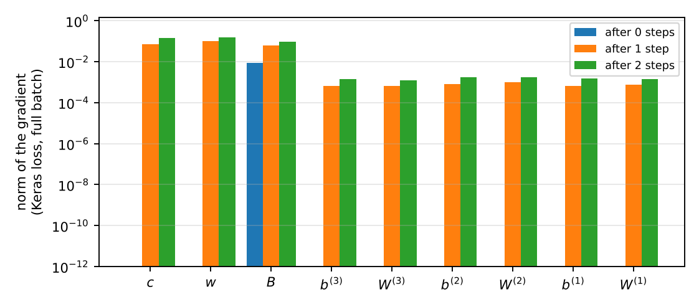

# Notation used in this document {-}

| Symbol | Meaning | Section |
|:--|:--|--:|
| $n$ | number of accident periods = number of development periods; here $n = 20$ (annual) | 2 |
| $i, j$ | accident period $1, \dots, n$ and development period $1, \dots, n$ (1-based, as in the code; Paper C's development year $j$ is $j - 1$ here) | 2 |
| $k = i + j - 1$ | calendar period of cell $(i, j)$; the valuation date is calendar period $n$ | 2 |
| $\mathcal{O}, \mathcal{F}$ | observed cells $\{i + j \le n + 1\}$ (210 of them) and future cells $\{i + j > n + 1\}$ (190) | 2 |
| $Y_{i,j}, y_{i,j}$ | incremental payments of cell $(i, j)$ as a random variable and as observed, in units of $u$ | 2 |
| $u$ | unit of the payments in the fit, $u = 10^6$ (`data: scale`) | 3.8 |
| $c, \alpha_i, \beta_j$ | intercept, accident-period effect and development-period effect of the ccODP model, $\alpha_1 = \beta_1 = 0$ | 3 |
| $\hat c, \hat\alpha_i, \hat\beta_j$ | their maximum likelihood estimates | 3 |
| $\mu_{i,j}$ | mean of cell $(i, j)$ under the model at hand; $\hat\mu^{\mathrm{cc}}_{i,j}$ for the fitted ccODP | 3, 4 |
| $\phi$ | dispersion: $\operatorname{Var}(Y_{i,j}) = \phi\, \mu_{i,j}$ | 3 |
| $D(\boldsymbol{y}, \boldsymbol{\mu}; \mathcal{S})$ | Poisson deviance of the means $\boldsymbol\mu$ on the cells $\mathcal{S}$ | 3.3 |
| $n_{\mathrm{obs}}, n_{\mathrm{par}}$ | number of fitted cells and of ccODP parameters, $n_{\mathrm{par}} = 2n - 1 = 39$ | 3.2 |
| $f_{j}$ | chain-ladder factor from development period $j$ to $j + 1$ | 3.6 |
| $q_1, q_2, q_3$ | neurons of the three hidden layers, $(20, 15, 10)$ | 4 |
| $W^{(h)}, b^{(h)}$ | weights ($q_{h-1} \times q_h$) and biases of hidden layer $h$, $q_0 = 2$ | 4 |
| $z^{(h)}(i, j)$ | activations of hidden layer $h$ for cell $(i, j)$; $z^{(0)} = (\alpha_i, \beta_j)^\top$ | 4 |
| $p$ | dropout rate, $p = 0.1$; $m^{(h)}$ a dropout mask | 4.5 |
| $w, c, B$ | weight of the skip connection, intercept and weights of the output neuron | 4.4 |
| $\theta$ | all trainable parameters, $\theta = (W^{(1)}, b^{(1)}, \dots, B, w, c)$; 547 numbers | 4 |
| $\theta_0$ | the start of gradient descent, eq. (14) of Paper C | 4.6 |
| $a_{i,j}$ | output before the exponential, $a = \log \mu$ | 4.4 |
| $\ell(\theta)$ | the loss Keras minimises (mean Poisson loss over the training cells) | 5 |
| $N$ | number of training cells, $N = 210$ on the full triangle | 5 |
| $\delta_{i,j}$ | derivative of the loss in the output $a_{i,j}$ | 6 |
| $\eta, \rho, \epsilon$ | RMSprop learning rate, decay and stabiliser: $0.001$, $0.9$, $10^{-7}$ | 6.5 |
| $\hat R_i, \hat R$ | reserve (predicted outstanding payments) of accident period $i$ and in total | 7 |
| $g(i, j)$ | cumulative development factor of accident period $i$ to development period $j$ | 9 |

Abbreviations: ccODP, cross-classified over-dispersed Poisson; bCCNN, blended cross-classified neural network; CL, chain ladder; MLE, maximum likelihood estimate; IWLS, iteratively weighted least squares. "Paper C" is Gabrielli, Richman and Wüthrich (2020), *Neural network embedding of the over-dispersed Poisson reserving model*, Scandinavian Actuarial Journal 2020(1):1-29; its equation numbers are quoted as your code comments quote them ((3), (4), (5), (13), (14), Listing 4). "Härkönen" is Härkönen (2021), *On claims reserving with machine learning techniques*, Master thesis, Stockholm University, the thesis you supplied; its Section 2.3.3 restates Paper C and is cited by its own equation numbers where it is used.

# What this document covers

This explainer writes out, formula by formula, what the bCCNN code computes on one $20 \times 20$ annual triangle: the cross-classified over-dispersed Poisson model that the chain ladder rests on, the neural network that is wrapped around it, the loss as Keras sees it, the gradients, and the properties of the starting point of gradient descent. The fitting procedure (which cells train, which cells stop the training, how the final network is chosen) is in the companion *The fitting procedure and training of the bCCNN*; the time-aware split is in *The time-aware split for the bCCNN*; interpretation, evaluation and uncertainty are in *The bCCNN as a whole*. The four documents share the notation above.

Two things in the code are not in Paper C and are marked where they appear: the rolling-origin early stopping (companion documents) and the fact that the hidden layers use Keras's default initialiser (Section 4.6, your `INFERRED` comment).

**How the maths was checked.** Every formula of Sections 3 to 9 was recomputed in plain numpy, without Keras, on a synthetic $20 \times 20$ triangle with the dimensions of your data (210 observed cells, payments in millions), and the two implementations were compared. The results are in Section 11. In short: the IWLS fit of Section 3 reproduces the chain-ladder reserve to a relative error of $5 \times 10^{-15}$ and satisfies the marginal-total equations to $10^{-11}$; the network at its starting point reproduces the ccODP means to $10^{-14}$; the analytic gradients of Section 6 agree with central finite differences to a relative error of $10^{-7}$ or better in every parameter group; the parameter count agrees with Keras's 547; and the predicted behaviour of the first RMSprop step (Section 6.5) is observed exactly.

# Set-up: the triangle

The portfolio has $n = 20$ accident periods (years) $i = 1, \dots, n$ and $n$ development periods $j = 1, \dots, n$. A cell $(i, j)$ holds the incremental payments $Y_{i,j}$ made in development period $j$ on claims of accident period $i$, that is, in calendar period

$$
k = i + j - 1 . \tag{1}
$$

At the valuation date, calendar period $n$, the observed cells are those with $k \le n$ and the future cells those with $k > n$:

$$
\begin{aligned}
&\mathcal{O} = \{(i, j) : i + j \le n + 1\}, \qquad \mathcal{F} = \{(i, j) : i + j > n + 1\}, \\
&|\mathcal{O}| = \tfrac{n(n+1)}{2} = 210, \qquad |\mathcal{F}| = 190 .
\end{aligned} \tag{2}
$$

The quantity to predict is the sum of the future cells, the outstanding payments to development period $n$,

$$
R = \sum_{(i, j) \in \mathcal{F}} Y_{i,j}, \qquad R_i = \sum_{j > n + 1 - i} Y_{i,j} . \tag{3}
$$

In the simulated data $R$ is known: `triangle_sets()` returns it as the matrix `test` (the lower triangle, `NA` above the diagonal). Payments after development period $n$ exist in the simulation but are in no triangle and no model; they are returned apart as `tail_o` and reported on their own row of the results table. (The simulator's `triangle.csv` folds them into column $n$, which for accident period 1 is an observed cell; the script checks that folding and then uses `triangle_sets()`'s triangles, which stop at development period $n$.)

In the code the square `sets$full` holds all $Y_{i,j}$, `sets$upper` holds $\mathcal{O}$ (future cells `NA`), and every amount is divided by $u = 10^6$ before fitting (`dat_cfg$scale`), so the fit runs in millions; Section 3.8 shows this changes nothing but the intercept.

# The ccODP model

## Assumptions

Paper C, Section 2, and Härkönen, Section 2.1, eq. (1)-(3). The incremental payments of the observed cells are independent, with

$$
\mathbb{E}[Y_{i,j}] = \mu_{i,j} = \exp\{ c + \alpha_i + \beta_j \}, \qquad \operatorname{Var}(Y_{i,j}) = \phi\, \mu_{i,j}, \qquad \phi > 0 . \tag{4}
$$

The model is called cross-classified because the two factors, accident period and development period, enter additively on the log scale: every accident period has the same development pattern $(e^{\beta_j})_j$, scaled by its own level $e^{c + \alpha_i}$. No interaction between $i$ and $j$ is allowed; that is exactly what the network of Section 4 adds.

"Over-dispersed Poisson" means the variance is $\phi$ times the mean instead of equal to it. A concrete distribution with these moments is the scaled Poisson $Y = \phi P$ with $P \sim \mathrm{Poisson}(\mu / \phi)$: then $\mathbb{E}[Y] = \phi \cdot \mu / \phi = \mu$ and $\operatorname{Var}(Y) = \phi^2 \cdot \mu / \phi = \phi \mu$. The fit, however, only uses the first two moments: it is a quasi-likelihood fit (`family = quasipoisson(link = "log")`), and $\phi$ is estimated afterwards (Section 3.7). The payments must be non-negative, and `fit_odp_glm()` stops if an observed increment is negative (Härkönen replaces negative aggregates by zero; your simulated triangle has none).

## Identification

The linear predictor $c + \alpha_i + \beta_j$ has $1 + n + n$ coefficients but only $2n - 1$ of them are identifiable: adding a constant to all $\alpha_i$ and subtracting it from $c$ changes nothing, and likewise for the $\beta_j$. Paper C's eq. (3) fixes

$$
\alpha_1 = \beta_1 = 0, \tag{5}
$$

so that $c$ is the log mean of cell $(1, 1)$, $\alpha_i$ is the log ratio of accident period $i$ to accident period 1 at the same development period, and $\beta_j$ the log ratio of development period $j$ to development period 1 within an accident period. In `fit_odp_glm()` this is R's treatment contrasts for `y ~ origin + dev` with `origin` and `dev` as factors whose first level is period 1: the intercept is $c$, the coefficient `origin`$i$ is $\alpha_i$ and `dev`$j$ is $\beta_j$. The number of parameters is

$$
n_{\mathrm{par}} = 1 + (n - 1) + (n - 1) = 2n - 1 = 39, \tag{6}
$$

against $n_{\mathrm{obs}} = |\mathcal{O}| = 210$ fitted cells on the full triangle.

## The Poisson deviance

For a mean vector $\boldsymbol\mu$ and a set of cells $\mathcal{S}$, the (unscaled) Poisson deviance is Paper C's eq. (4):

$$
D(\boldsymbol{y}, \boldsymbol{\mu}; \mathcal{S}) = 2 \sum_{(i, j) \in \mathcal{S}} \Big( \mu_{i,j} - y_{i,j} + y_{i,j} \log \frac{y_{i,j}}{\mu_{i,j}} \Big), \qquad 0 \log 0 := 0 . \tag{7}
$$

It is `poisson_deviance(y, mu)` in `R/loss functions.R`, which drops the cells where `y` is `NA` (that is how the same function scores the observed triangle, a validation mask or the true lower triangle). Each summand is non-negative and zero only when $\mu_{i,j} = y_{i,j}$, because $x \mapsto \mu - x + x \log(x / \mu)$ is the Bregman divergence of $x \log x$.

Where it comes from. The Poisson log-likelihood of the observed cells, with the means scaled by $\phi$ as in the scaled-Poisson representation, is up to a constant

$$
\ell(\boldsymbol\mu) = \frac{1}{\phi} \sum_{\mathcal{S}} \big( y_{i,j} \log \mu_{i,j} - \mu_{i,j} \big) . \tag{8}
$$

The saturated model sets $\mu_{i,j} = y_{i,j}$ and attains $\ell_{\mathrm{sat}} = \frac{1}{\phi} \sum (y \log y - y)$. Twice the gap, times $\phi$, is (7):

$$
D = 2 \phi \big( \ell_{\mathrm{sat}} - \ell(\boldsymbol\mu) \big) . \tag{9}
$$

Since $\phi$ only multiplies the whole log-likelihood, maximising (8) and minimising (7) give the same $\hat{\boldsymbol\mu}$ for every $\phi$: the dispersion plays no part in the point estimates (Härkönen, p. 5, makes the same remark). This is why the network can use the deviance as its loss and still estimate $\phi$ separately.

## The maximum likelihood equations

Write $a_{i,j} = \log \mu_{i,j} = c + \alpha_i + \beta_j$. Differentiating one summand of (7) in $a_{i,j}$,

$$
\frac{\partial}{\partial a_{i,j}} \, 2 \Big( e^{a_{i,j}} - y_{i,j} + y_{i,j} \log y_{i,j} - y_{i,j} a_{i,j} \Big) = 2 \big( \mu_{i,j} - y_{i,j} \big) . \tag{10}
$$

By the chain rule, with $\partial a_{i,j} / \partial c = 1$, $\partial a_{i,j} / \partial \alpha_{i'} = \mathbf{1}\{i = i'\}$ and $\partial a_{i,j} / \partial \beta_{j'} = \mathbf{1}\{j = j'\}$,

$$
\begin{aligned}
\frac{\partial D}{\partial c} &= 2 \sum_{(i,j) \in \mathcal{O}} (\mu_{i,j} - y_{i,j}), \\
\frac{\partial D}{\partial \alpha_{i}} &= 2 \sum_{j \le n + 1 - i} (\mu_{i,j} - y_{i,j}), \qquad
\frac{\partial D}{\partial \beta_{j}} = 2 \sum_{i \le n + 1 - j} (\mu_{i,j} - y_{i,j}) .
\end{aligned} \tag{11}
$$

At the MLE all of these vanish (for $i, j \ge 2$ directly; for $i = 1$ and $j = 1$ because the total minus the others vanishes too). So the fitted ccODP reproduces every observed row total and every observed column total of the triangle:

$$
\begin{aligned}
\sum_{j \le n + 1 - i} \hat\mu^{\mathrm{cc}}_{i,j} &= \sum_{j \le n + 1 - i} y_{i,j} \qquad (i = 1, \dots, n), \\
\sum_{i \le n + 1 - j} \hat\mu^{\mathrm{cc}}_{i,j} &= \sum_{i \le n + 1 - j} y_{i,j} \qquad (j = 1, \dots, n) .
\end{aligned} \tag{12}
$$

This "marginal totals" property is the whole reason the ccODP is the chain ladder (Section 3.6), and it is also why two of the network's gradients vanish at the start (Section 6.4). The numerical check finds the row and column sums of $\hat\mu - y$ at $10^{-11}$.

## How glm() solves them: IWLS

`stats::glm()` solves (11) by Fisher scoring, which for a GLM is iteratively weighted least squares. With the design matrix $X$ ($210 \times 39$: a column of ones, 19 accident-period dummies, 19 development-period dummies) and coefficient vector $\vartheta = (c, \alpha_2, \dots, \alpha_n, \beta_2, \dots, \beta_n)$, each iteration computes, from the current $\vartheta$,

$$
\begin{aligned}
&\eta = X \vartheta, \qquad \mu = e^{\eta}, \qquad z = \eta + \frac{y - \mu}{\mu} \ \ \text{(working response)}, \\
&W = \operatorname{diag}(\mu) \ \ \text{(working weights)}, \qquad \vartheta_{\mathrm{new}} = (X^\top W X)^{-1} X^\top W z .
\end{aligned} \tag{13}
$$

For the log link the working weight $\mu$ comes from $(\partial\mu/\partial\eta)^2 / \operatorname{Var} = \mu^2 / \mu$. The code runs it with `glm.control(epsilon = 1e-12, maxit = 100)`, so the relative change of the deviance between iterations has to fall below $10^{-12}$; it warns if that is not reached and stops if a coefficient is `NA` (the fitted cells then do not connect all periods). The same routine fits a subset of the observed cells when a `cells` mask is given (rolling-origin partitions); then (11)-(12) hold over the fitted cells only.

## The ccODP is the chain ladder

**Statement.** Let $\hat\mu^{\mathrm{cc}}$ be the ccODP MLE on the full observed triangle, and define the fitted and predicted cumulative payments $\hat C_{i,j} = \sum_{l \le j} \hat\mu^{\mathrm{cc}}_{i,l}$. Then $\hat C_{i,n}$ equals the chain-ladder ultimate of accident period $i$, the latest cumulative $C_{i, n+1-i} = \sum_{j \le n+1-i} y_{i,j}$ multiplied by the volume-weighted chain-ladder factors,

$$
\hat C_{i,n} = C_{i, n + 1 - i} \prod_{k = n + 1 - i}^{n - 1} f_k, \qquad f_k = \frac{\sum_{i' \le n - k} C_{i', k + 1}}{\sum_{i' \le n - k} C_{i', k}}, \tag{14}
$$

so that the ccODP reserve $\hat R = \sum_{\mathcal{F}} \hat\mu^{\mathrm{cc}}_{i,j}$ is the chain-ladder reserve. (Hachemeister and Stanard 1975; Mack 1991; Renshaw and Verrall 1998, the reference Härkönen gives as [13]; Paper C, Section 2.) The script asserts it: `all.equal(res$odp$reserve * scale, cl$total[["ibnr"]])`.

**Proof.** Write $\hat\mu^{\mathrm{cc}}_{i,j} = \hat a_i \hat b_j$ with $\hat a_i = e^{\hat c + \hat\alpha_i}$ and $\hat b_j = e^{\hat\beta_j}$, and $S_k = \sum_{j \le k} \hat b_j$, so that $\hat C_{i,k} = \hat a_i S_k$. Fix $k \in \{2, \dots, n\}$.

*Step 1.* Sum the column equations of (12) over columns $1, \dots, k$. The cells involved are the observed cells in those columns. They split into the rows $i \le n + 1 - k$, for which all cells $(i, 1), \dots, (i, k)$ are observed, and the rows $i \ge n + 2 - k$, whose observed cells all lie in columns $\le n + 1 - i \le k - 1$, so the whole observed row is included. For those later rows the row equations of (12) say fitted row total = observed row total; subtracting them leaves

$$
\sum_{i \le n + 1 - k} \hat C_{i,k} = \sum_{i \le n + 1 - k} C_{i,k} . \tag{15}
$$

*Step 2.* Apply (15) with $k - 1$ in place of $k$: it runs over the rows $i \le n + 2 - k$. The extra row $i = n + 2 - k$ has observed cells exactly up to column $k - 1$, so its row equation reads $\hat C_{n+2-k, k-1} = C_{n+2-k, k-1}$. Subtracting it,

$$
\sum_{i \le n + 1 - k} \hat C_{i,k-1} = \sum_{i \le n + 1 - k} C_{i,k-1} . \tag{16}
$$

*Step 3.* Divide (15) by (16): the right-hand side is the chain-ladder factor $f_{k-1}$ of (14); the left-hand side is $\hat a_\bullet S_k / (\hat a_\bullet S_{k-1})$ with $\hat a_\bullet = \sum_{i \le n+1-k} \hat a_i$. Hence

$$
\frac{S_k}{S_{k-1}} = f_{k-1}, \qquad k = 2, \dots, n . \tag{17}
$$

*Step 4.* The row equation of (12) for accident period $i$ says $\hat a_i S_{n+1-i} = C_{i, n+1-i}$. Therefore $\hat C_{i,n} = \hat a_i S_n = C_{i,n+1-i} \, S_n / S_{n+1-i} = C_{i,n+1-i} \prod_{k=n+2-i}^{n} S_k / S_{k-1}$, which by (17) is (14). $\square$

Two consequences are used later. First, (17) says the fitted development pattern of the ccODP is the chain-ladder pattern, the same for every accident period (Section 9). Second, the proof uses only the marginal-total equations (12); the bCCNN does not satisfy them after the first gradient step, so its reserve is no longer a chain-ladder reserve.

## Dispersion

The point estimates do not need $\phi$, but the variance (4), the Pearson residuals and any standard error do. `fit_odp_glm()` returns both usual estimators, with the degrees of freedom $n_{\mathrm{obs}} - n_{\mathrm{par}} = 210 - 39 = 171$ on the full triangle:

$$
\begin{aligned}
\hat\phi_D &= \frac{D(\boldsymbol{y}, \hat{\boldsymbol\mu}^{\mathrm{cc}}; \mathcal{O})}{n_{\mathrm{obs}} - n_{\mathrm{par}}} \qquad \text{(Paper C eq. (5), the default)}, \\
\hat\phi_P &= \frac{1}{n_{\mathrm{obs}} - n_{\mathrm{par}}} \sum_{\mathcal{O}} \frac{(y_{i,j} - \hat\mu^{\mathrm{cc}}_{i,j})^2}{\hat\mu^{\mathrm{cc}}_{i,j}} .
\end{aligned} \tag{18}
$$

Both are moment estimators of the ratio variance-to-mean: under (4) each Pearson term has expectation about $\phi$, and the deviance term agrees with it to second order. `config.yml` selects `odp: phi: deviance`. The dispersion of the bCCNN is a separate matter (Section 8).

## The unit of the payments

The fit runs on $y / u$ with $u = 10^6$. Let $\boldsymbol\mu'$ be the MLE on $\boldsymbol y' = \boldsymbol y / u$. Since $\log(\mu_{i,j} / u) = (c - \log u) + \alpha_i + \beta_j$, the scaled model is the same model with intercept shifted, and the deviance scales linearly:

$$
\begin{aligned}
&D(\boldsymbol{y} / u, \boldsymbol\mu / u) = \frac{1}{u} D(\boldsymbol{y}, \boldsymbol\mu), \qquad \text{so} \\
&\hat c' = \hat c - \log u, \quad \hat\alpha' = \hat\alpha, \quad \hat\beta' = \hat\beta, \quad \hat{\boldsymbol\mu}' = \hat{\boldsymbol\mu} / u, \quad \hat R' = \hat R / u, \quad \hat\phi' = \hat\phi / u .
\end{aligned} \tag{19}
$$

The Pearson residual $(y - \mu) / \sqrt{\phi \mu}$ is invariant ($u$ cancels), and so is the relative difference $\mu^{\mathrm{bCCNN}} / \mu^{\mathrm{cc}} - 1$. The numerical check confirms (19) to $10^{-13}$. For the network the unit matters only through the fixed inputs: $\alpha_i$ and $\beta_j$ do not change with $u$, so the hidden layers see the same inputs whatever the unit; the output intercept starts at $\hat c'$. Unlike SGD, RMSprop's steps are (almost) invariant to the scale of the gradient (companion document, Section 5), so the choice of unit changes the training very little.

## Periods without payments

If an accident period or a development period has no payments in the fitted cells, its MLE is $-\infty$: the deviance keeps decreasing as the effect goes to $-\infty$, and `glm()` stops at a large negative value (about $-30$) that it reports as converged, with fitted means of order $e^{-30}$. `fit_odp_glm()` flags these as `zero_origin` and `zero_dev` and warns. They matter for the network because the embedding of that period is then $\approx -30$, far outside the range of the other effects, and because a validation cell in such a period would be scored with $\mu \approx 0$: `bccnn_validation()` therefore sets those validation cells to `NA` (companion document, Section 3). On the full annual triangle every period has payments.

# The bCCNN network

Paper C, Section 3, Listing 4; Härkönen, Section 2.3.3. The network is drawn in Figure 1 with the layer names of `bccnn_model()`.

{width=96%}

## Embedding layers

The inputs are the categorical accident period and development period of a cell, passed to Keras as the 0-based integers $i - 1$ and $j - 1$ (`bccnn_inputs()`). An embedding layer maps a category to a vector; here each is one-dimensional and holds the ccODP effect of that period (Paper C's eqs. (9)-(10), Härkönen's (33)-(34)):

$$
\mathrm{AY\_embed}: \ i \mapsto \hat\alpha_i, \qquad \mathrm{DY\_embed}: \ j \mapsto \hat\beta_j . \tag{20}
$$

The two embedding matrices ($20 \times 1$ each, 40 numbers) are set to the MLE with `set_weights()` and frozen (`trainable = trainable_embeddings`, `false` in `config.yml`), as Härkönen does and as Paper C's Listing 4 does. If they were trainable, 40 parameters would be added to $\theta$, the skip connection would stop being exactly the ccODP after the first step, and Härkönen reports that the predictions improved for some lines of business at a higher computation cost (her "TW" rows). Everything below assumes they are fixed.

## The skip connection

`cc0 = layer_add(AY_flat, DY_flat)` is the ccODP linear predictor without its intercept,

$$
\mathrm{cc}_0(i, j) = \hat\alpha_i + \hat\beta_j . \tag{21}
$$

It goes straight to the output neuron (the green path of Figure 1). This is Härkönen's "skip-connection" and Paper C's "embedding" of the ccODP: the classical model is a sub-network of the bCCNN.

## The feed-forward part

The same two numbers are also concatenated into the input of a feed-forward network,

$$
z^{(0)}(i, j) = (\hat\alpha_i, \hat\beta_j)^\top \in \mathbb{R}^2, \tag{22}
$$

followed by three dense layers with hyperbolic tangent activation and $q_1 = 20$, $q_2 = 15$, $q_3 = 10$ neurons (Härkönen eq. (40); Paper C Listing 4):

$$
z^{(h)}(i, j) = \tanh\!\Big( b^{(h)} + W^{(h)\top} z^{(h-1)}(i, j) \Big) \in \mathbb{R}^{q_h}, \qquad h = 1, 2, 3, \tag{23}
$$

where $\tanh$ acts component-wise, $W^{(h)} \in \mathbb{R}^{q_{h-1} \times q_h}$ and $b^{(h)} \in \mathbb{R}^{q_h}$. A dropout layer with rate $p = 0.1$ follows each hidden layer (Section 4.5). Härkönen gives the two reasons for $\tanh$: its derivative is $1 - \tanh^2$, cheap to compute from the activation itself (Section 6.3), and its range $(-1, 1)$ keeps the activations bounded.

The trainable parameters are counted in Table 1; the total 547 agrees with Keras's `summary()` of the model (the 40 embedding numbers appear there as non-trainable).

| layer | input $\times$ output | weights | biases | trainable parameters |
|:--|:--|--:|--:|--:|
| hidden1 | $2 \times 20$ | 40 | 20 | 60 |
| hidden2 | $20 \times 15$ | 300 | 15 | 315 |
| hidden3 | $15 \times 10$ | 150 | 10 | 160 |
| Response | $11 \times 1$ | 11 | 1 | 12 |
| **total trainable** | | | | **547** |
| embeddings (frozen) | $20 \times 1$, twice | 40 | 0 | 0 (40 non-trainable) |

Table 1: Parameters of the network, Härkönen's eq. (76) with $q_0 = 2$, $q_4 = 1$, plus the skip weight.

## The output neuron and eq. (13)

`concate1` joins the skip connection and the last hidden layer into an 11-vector $(\mathrm{cc}_0(i,j), z^{(3)}(i,j)) \in \mathbb{R}^{11}$, and `Response` is a dense layer with one neuron and exponential activation. Writing its 11 weights as $(w, B)$ with $w \in \mathbb{R}$ on the skip connection and $B \in \mathbb{R}^{10}$ on the hidden features, and its bias as $c$, the network's mean for cell $(i, j)$ is Paper C's eq. (13):

$$
\mu_{i,j}(\theta) = \exp\Big\{ \underbrace{w \, (\hat\alpha_i + \hat\beta_j)}_{\text{skip connection}} + \underbrace{c + \langle B, z^{(3)}(i, j) \rangle}_{\text{network}} \Big\}, \qquad a_{i,j} := \log \mu_{i,j} . \tag{24}
$$

Paper C keeps $w$ trainable, as `bccnn_model()` does (your comment "exactly as Listing 4 does"); Härkönen's eq. (44) writes the skip connection with weight 1. Both views of (24) are useful:

* **Multiplicative boosting.** Factor out the ccODP mean: $\mu_{i,j} = \hat\mu^{\mathrm{cc}}_{i,j} \cdot \exp\{ (w - 1)(\hat\alpha_i + \hat\beta_j) + (c - \hat c) + \langle B, z^{(3)}(i,j) \rangle \}$. The network learns a multiplicative correction of the chain-ladder means, which is 1 at the start. This is the CANN (combined actuarial neural network) idea of Wüthrich and Merz (2019) that Härkönen cites as [15], and Paper C's "neural network boosting".
* **A function of two scalars.** The feed-forward part sees only $(\hat\alpha_i, \hat\beta_j)$. Whatever it learns is a smooth surface $g(\alpha, \beta)$ evaluated at the 20 accident effects and 20 development effects. Two accident periods with equal $\hat\alpha$ receive the same correction at every development period; the correction for a future cell $(i, j)$ is the surface at the pair $(\hat\alpha_i, \hat\beta_j)$, a combination never seen in training even though each coordinate was. What the network can add to the ccODP is therefore exactly an interaction between the accident-period effect and the development-period effect, that is, accident-period-dependent development patterns (Section 9, cumulative factors).

## Dropout

Keras's dropout is "inverted dropout" (Srivastava et al. 2014, Härkönen's [14] and eq. (31)-(32)). During training, after each hidden layer a mask of independent Bernoulli variables is drawn and the surviving activations are scaled up so that their expectation is unchanged:

$$
\begin{aligned}
&\tilde z^{(h)} = \frac{z^{(h)} \odot m^{(h)}}{1 - p}, \qquad m^{(h)}_r \sim \mathrm{Bernoulli}(1 - p) \ \text{independently}, \\
&\mathbb{E}[\tilde z^{(h)} \mid z^{(h)}] = z^{(h)} .
\end{aligned} \tag{25}
$$

The next layer reads $\tilde z^{(h)}$ in place of $z^{(h)}$ in (23), and the output neuron reads $\tilde z^{(3)}$ in (24). At prediction time (`predict_on_batch`, `predict`) no mask is drawn and (23)-(24) hold as written. Two consequences for what the code records (Section 5.2): the loss Keras prints during training is the loss of a randomly thinned network, and it is reported as the column `train_dropout`; the deviances in the columns `train`, `vali`, `test`, `truth` are computed from `predict_on_batch()` after each step, without dropout. Paper C's Figure 2 shows the first kind of curve (noisy), Table 3 reports both kinds. Härkönen's remark on dropout, that each neuron must learn features that are useful without relying on particular other neurons, is the reason it regularises a network with 547 parameters on 210 cells.

## The initialisation: Paper C's eq. (14)

Keras builds the model with its default initialisers: Glorot-uniform weights, $W^{(h)}_{r,s} \sim \mathrm{U}(-\lambda_h, \lambda_h)$ with $\lambda_h = \sqrt{6 / (q_{h-1} + q_h)}$, and zero biases, for the three hidden layers and for `Response`; `set_random_seed(seed)` fixes the draw. Then `bccnn_model()` overwrites the embeddings and the output neuron:

$$
\begin{aligned}
\theta_0: \qquad &\mathrm{AY\_embed} = \hat\alpha, \qquad \mathrm{DY\_embed} = \hat\beta, \\
&w = 1, \qquad c = \hat c, \qquad B = 0 \in \mathbb{R}^{10}, \\
&(W^{(h)}, b^{(h)}) \ \text{random: Glorot-uniform weights, zero biases}, \qquad h = 1, 2, 3 .
\end{aligned} \tag{26}
$$

**Property 1: the start is the ccODP model.** With $B = 0$ the hidden layers do not reach the output, whatever their random weights, and (24) becomes $\mu_{i,j}(\theta_0) = \exp\{ \hat\alpha_i + \hat\beta_j + \hat c \} = \hat\mu^{\mathrm{cc}}_{i,j}$ for every cell, observed or future. Hence the deviance at step 0 equals the ccODP deviance, the reserve at step 0 equals the chain-ladder reserve (Section 3.6), and every cumulative development factor at step 0 is the chain-ladder factor. The record at `epoch = 0` of the history is this start. Keras holds the weights in single precision, so in R the equality holds to about $10^{-7}$ relative; in the double-precision check it holds to $10^{-14}$.

This is what makes the bCCNN a calibration of the chain ladder rather than a new model: the number of gradient steps measures how far the network is allowed to move away from the chain ladder, and $t^* = 0$ returns the chain ladder itself.

**INFERRED, your comment in `bCCNN fit.R`.** The Python version of the single bCCNN used torch's default initialiser, $\mathrm{U}(\pm 1/\sqrt{\text{fan-in}})$, for the hidden layers, with the observation that it "leaves the chain ladder about three times more slowly". The reason is visible in Section 6.4: the only non-zero gradient at the start is the one in $B$, and it is proportional to the hidden activations $z^{(3)}$; smaller initial weights make $z^{(3)}$ smaller and closer to zero, so the first steps add less. Paper C's own default is Keras's, which the R code keeps.

# The loss as Keras sees it

## Keras's "poisson" loss and the deviance

`compile(loss = "poisson")` minimises the mean over the $N$ training cells of $\mu - y \log(\mu + \varepsilon)$, with Keras's small $\varepsilon = 10^{-7}$ inside the logarithm,

$$
\ell(\theta) = \frac{1}{N} \sum_{r = 1}^{N} \Big( \mu_r(\theta) - y_r \log \big( \mu_r(\theta) + \varepsilon \big) \Big) . \tag{27}
$$

Dropping $\varepsilon$ (its effect on $\ell$ is below $10^{-7}$ here), (27) and the deviance (7) over the same cells differ by a constant that does not depend on $\theta$:

$$
D(\boldsymbol y, \boldsymbol\mu(\theta); \mathcal{S}) = 2 N \, \ell(\theta) + 2 \sum_{r = 1}^{N} \big( y_r \log y_r - y_r \big) . \tag{28}
$$

So minimising Keras's loss is minimising the Poisson deviance, the same criterion the ccODP was fitted by (Paper C, Section 3.3; Härkönen, Section 2.3.5, eq. (72)), and the gradients differ only by the factor $2N$. The function `keras_poisson_to_deviance(loss, y)` is (28); the code applies it to the loss Keras reports after each epoch to obtain the column `train_dropout` in the units of the other columns.

## What is recorded after every step

`fit_bccnn()` keeps every cell of the $n \times n$ square in `x_all` and the training cells in `x_fit`. After each gradient step a Keras callback runs `predict_on_batch(x_all)` (no dropout), reshapes the result to the $n \times n$ matrix $\mu^{(t)}$ and stores one row of the history:

| column | formula | cells |
|:--|:--|:--|
| `epoch` | step $t$ ($0$ = the ccODP start) | |
| `train_dropout` | $2 N \ell^{\mathrm{drop}}_{t} + 2 \sum (y \log y - y)$, from the loss Keras reported for epoch $t$ (with dropout; computed before that epoch's update, so it belongs to $\theta_{t-1}$) | training cells |
| `train` | $D(\boldsymbol y, \mu^{(t)}; \text{training cells})$ | training cells |
| `vali`, `test`, `truth` | $D(\cdot, \mu^{(t)}; \cdot)$ on the cells of each tracked matrix (NA elsewhere) | validation, test, true lower triangle |
| `*_pred` | $\sum \mu^{(t)}_{i,j}$ over the cells of each tracked matrix | the same |

Table 2: The history of `fit_bccnn()`.

With `batch_size = NULL` the batch is all $N$ training cells, so one Keras epoch is exactly one gradient-descent step and `epoch` counts steps, as in Paper C ("gradient descent iteration"). The companion document uses these columns for the stopping rule.

# Gradients

The gradient Keras computes by automatic differentiation is written out here for the loss (27); for the deviance multiply by $2N$. Everything is per cell $r = (i, j)$ of the training set, summed over the batch.

## Derivative in the output

From (10) and (27), with $a_r = \log \mu_r$,

$$
\delta_r := \frac{\partial \ell}{\partial a_r} = \frac{1}{N} \big( \mu_r - y_r \big) . \tag{29}
$$

The signal that drives every parameter is the residual $\mu_r - y_r$ of the cell: positive where the network over-predicts, negative where it under-predicts, and zero in a cell that is fitted exactly.

## Output layer

From (24), $\partial a_r / \partial c = 1$, $\partial a_r / \partial w = \hat\alpha_i + \hat\beta_j$ and $\partial a_r / \partial B = \tilde z^{(3)}_r$, so

$$
\frac{\partial \ell}{\partial c} = \sum_r \delta_r, \qquad
\frac{\partial \ell}{\partial w} = \sum_r \delta_r \, (\hat\alpha_i + \hat\beta_j), \qquad
\frac{\partial \ell}{\partial B} = \sum_r \delta_r \, \tilde z^{(3)}_r \in \mathbb{R}^{10} . \tag{30}
$$

## Hidden layers (back-propagation)

Let $\gamma^{(h)}_r \in \mathbb{R}^{q_h}$ be the derivative of $\ell$ in the pre-activation $u^{(h)}_r = b^{(h)} + W^{(h)\top} \tilde z^{(h-1)}_r$ of layer $h$. Since $z = \tanh(u)$ has $\partial z / \partial u = 1 - z^2$, and the mask of (25) multiplies the activation,

$$
\begin{aligned}
\gamma^{(3)}_r &= \delta_r \, \Big( B \odot \frac{m^{(3)}_r}{1 - p} \Big) \odot \big( 1 - z^{(3)2}_r \big), \\
\gamma^{(h)}_r &= \Big( W^{(h+1)} \gamma^{(h+1)}_r \odot \frac{m^{(h)}_r}{1 - p} \Big) \odot \big( 1 - z^{(h)2}_r \big), \qquad h = 2, 1,
\end{aligned} \tag{31}
$$

and the parameter gradients are

$$
\begin{aligned}
\frac{\partial \ell}{\partial W^{(h)}} &= \sum_r \tilde z^{(h-1)}_r \, \gamma^{(h)\top}_r \in \mathbb{R}^{q_{h-1} \times q_h}, \qquad
\frac{\partial \ell}{\partial b^{(h)}} = \sum_r \gamma^{(h)}_r, \\
&h = 1, 2, 3, \qquad \tilde z^{(0)}_r = z^{(0)}_r .
\end{aligned} \tag{32}
$$

Without dropout set every mask to $1 - p$ so the factors $m / (1 - p)$ become 1. The numerical check compares (30)-(32) (no dropout) with central finite differences of the deviance at the start and at a random point: the largest relative error over all nine parameter groups is $1.1 \times 10^{-6}$ (in $W^{(3)}$), the others are at $10^{-7}$ or below (Section 11).

## Property 2: the gradient at the start

At $\theta_0$ the means are the ccODP means, so $\delta_r = (\hat\mu^{\mathrm{cc}}_r - y_r) / N$, and the marginal-total equations (12) give:

* $\partial \ell / \partial c = \frac{1}{N} \sum_{\mathcal{O}} (\hat\mu^{\mathrm{cc}} - y) = 0$ (the total);
* $\partial \ell / \partial w = \frac{1}{N} \big( \sum_i \hat\alpha_i \sum_{j} (\hat\mu^{\mathrm{cc}}_{i,j} - y_{i,j}) + \sum_j \hat\beta_j \sum_{i} (\hat\mu^{\mathrm{cc}}_{i,j} - y_{i,j}) \big) = 0$ (row and column totals);
* every hidden-layer gradient is zero, because $B = 0$ makes $\gamma^{(3)}_r = 0$ in (31) and hence $\gamma^{(2)} = \gamma^{(1)} = 0$;
* $\partial \ell / \partial B = \frac{1}{N} \sum_r (\hat\mu^{\mathrm{cc}}_r - y_r) \, \tilde z^{(3)}_r$ is the only non-zero component.

So the first gradient step changes nothing but $B$: it adds to the ccODP log-mean the linear combination $\langle \Delta B, z^{(3)}(i, j) \rangle$ of the ten random hidden features that is most correlated (in the sense of (30)) with the chain-ladder residuals. This is a boosting step on the residuals of the chain ladder with random features, nothing else. From the second step on, $B \ne 0$ and the gradient flows back into the hidden layers, which then start to shape the features themselves; $c$ and $w$ also start to move, because the marginal-total equations no longer hold once $B \ne 0$. Figure 2 shows the norms of the nine gradient groups over the first steps in the numerical check: at step 0 only $B$ is non-zero ($c$ and $w$ are at $10^{-14}$, the hidden layers at exactly 0); after one step all are non-zero, with $c$, $w$ and $B$ two orders of magnitude above the hidden layers.

{width=85%}

This property holds on the full triangle and on the training half of the claims split (the ccODP is refitted on the training cells, so (12) holds there). It holds equally for a rolling-origin partition, where the ccODP is fitted on the training cells of the partition by the same `glm()` call: (12) then holds over those cells.

## Property 3: the size of the first steps

The optimiser is RMSprop with Keras's parameterisation (companion document, Section 5): for each coordinate $\vartheta$ of $\theta$ with gradient $g_t$,

$$
v_t = \rho \, v_{t-1} + (1 - \rho) \, g_t^2, \qquad \vartheta_t = \vartheta_{t-1} - \eta \, \frac{g_t}{\sqrt{v_t} + \epsilon}, \qquad v_0 = 0 . \tag{33}
$$

At the first step $v_1 = (1 - \rho) g_1^2$, so the update is $\eta \, g_1 / (\sqrt{1 - \rho}\, |g_1| + \epsilon)$. For every coordinate whose gradient is not tiny ($|g_1| \gg \epsilon / \sqrt{1 - \rho} \approx 3 \times 10^{-7}$) this is

$$
\Delta \vartheta_1 \approx - \frac{\eta}{\sqrt{1 - \rho}} \operatorname{sign}(g_1) = \mp 0.00316, \tag{34}
$$

independent of the size of the gradient. Hence the first step moves each of the ten coordinates of $B$ by $\pm 0.00316$ exactly, and nothing else (the coordinates $c$ and $w$, whose gradient is $10^{-14}$, move by $\eta g / \epsilon \approx 10^{-10}$). The check reports $\max |\Delta B_1| = 0.0031621$ against $0.0031623$ from (34). Two things follow. First, the early path away from the chain ladder is set by $\eta$, $\rho$ and the random features, not by how badly the chain ladder fits: a triangle the chain ladder fits well and one it fits badly both move by the same amount at step 1. Second, because the step is sign-like rather than proportional, the training deviance need not fall at first: in the check it goes $108.967 \to 109.034 \to 109.198 \to 108.973$ over the first three steps before it starts to decrease. Paper C's and your loss curves start with the same kind of wobble.

# From the fitted means to the reserves

Whatever the model, the reserve is the sum of the predicted means over the future cells, Paper C's Section 3.3.3:

$$
\hat R_i = \sum_{j > n + 1 - i} \mu_{i,j}, \qquad \hat R = \sum_{i = 1}^{n} \hat R_i = \sum_{(i,j) \in \mathcal{F}} \mu_{i,j} . \tag{35}
$$

`reserve_by_origin(y, mu)` returns, per accident period, the latest cumulative $C_{i, n+1-i}$ (`latest`), $\hat R_i$ (`ibnr`), their sum (`ultimate`) and the ratio `dev_to_date` $= C_{i,n+1-i} / (C_{i,n+1-i} + \hat R_i)$; `reserve_totals()` sums them. For the ccODP, (35) is the chain-ladder reserve by Section 3.6; for the bCCNN it is the sum of (24) over $\mathcal{F}$ at the chosen step. There are no standard errors in this strand of the code (`se`, `cv` are `NA`); the companion *The bCCNN as a whole* discusses how the uncertainty of (35) can be obtained.

# Dispersion of the bCCNN

A bCCNN has 547 parameters and is trained on 210 cells, so the GLM estimator (18) with $n_{\mathrm{obs}} - n_{\mathrm{par}}$ in the denominator does not exist for it; Härkönen notes exactly this for her networks (Section 5: "the number of parameters [...] is even larger than the number of observations which implies that the estimated overdispersion parameter cannot be computed according to Pearson statistics"). Paper C, Section 3.3.2 and Table 2, uses a heuristic instead: the ccODP dispersion is reduced by the relative decrease of the *validation* loss that the network achieved,

$$
\hat\phi^{\mathrm{bCCNN}} = \hat\phi_D \, \big( 1 - \max(0, \Delta_V) \big), \qquad \Delta_V = 1 - \frac{D_V(t^*)}{D_V(0)}, \tag{36}
$$

where $D_V(t)$ is the validation deviance after $t$ steps (companion document). The logic is that the deviance is an estimate of $\phi$ times the degrees of freedom; if the network explains a fraction $\Delta_V$ of the out-of-sample deviance, the unexplained variance is reduced by that fraction. The cut at zero means a network that does not beat the chain ladder on the validation cells keeps the chain ladder's dispersion (Paper C sets 0% for its LoBs 3 and 6). It is `bccnn_phi(phi_odp, decrease_vali)` and feeds the Pearson residuals of the bCCNN.

# Diagnostics computed from the means

**Pearson residuals** (Paper C Figure 7; `pearson_residuals()`), on the true lower triangle in the script:

$$
r_{i,j} = \frac{y_{i,j} - \mu_{i,j}}{\sqrt{\hat\phi \, \mu_{i,j}}}, \tag{37}
$$

with the model's own $\hat\phi$ ((18) for the ccODP, (36) for the bCCNN). Under (4) they have mean 0 and variance 1 in the fitted cells; on the lower triangle they are out-of-sample standardised errors.

**Cumulative development factors** (Paper C Figure 8; `cum_dev_factors()`). From a mean square $\mu$, the individual factor of accident period $i$ from development period $j - 1$ to $j$ and its cumulative version are

$$
f(i, j) = \frac{\sum_{l \le j} \mu_{i,l}}{\sum_{l \le j - 1} \mu_{i,l}}, \qquad g(i, j) = \prod_{l = 2}^{j} f(i, l) = \frac{\sum_{l \le j} \mu_{i,l}}{\mu_{i,1}}, \qquad j = 2, \dots, n . \tag{38}
$$

Under the ccODP, $\mu_{i,l} = \hat a_i \hat b_l$ gives $g(i, j) = S_j / \hat b_1 = S_j$ (since $\hat\beta_1 = 0$), the same for every accident period, and by (17) it equals the product of the chain-ladder factors $\prod_{l=2}^{j} f_{l-1}$: every row of the ccODP factor matrix is the chain-ladder pattern. The numerical check finds the spread across rows at $3 \times 10^{-15}$. The bCCNN breaks the product form through the interaction term $\langle B, z^{(3)}(i, j) \rangle$, so its $g(i, j)$ vary with $i$: the plot of (38) against $j$ with one line per accident period shows directly how far the network has let the development pattern depend on the accident period.

**Relative difference** (Paper C Figure 5; `plot_relative_difference()`),

$$
\frac{\mu^{\mathrm{bCCNN}}_{i,j}}{\hat\mu^{\mathrm{cc}}_{i,j}} - 1 = \exp\Big\{ (w - 1)(\hat\alpha_i + \hat\beta_j) + (c - \hat c) + \langle B, z^{(3)}(i, j) \rangle \Big\} - 1, \tag{39}
$$

is the multiplicative correction of Section 4.4 minus one, shown as a heat map over the whole square. It is zero everywhere at step 0.

# Where each formula is in the code

| formula | where |
|:--|:--|
| (1)-(3) cells, observed set, reserve to predict | `triangle_sets()`, `fut_mask()`, `upper()`, `fut_cells()` in `R/triangles.R` |
| (4)-(6) ccODP model and identification | `fit_odp_glm()`: `glm(y ~ origin + dev, family = quasipoisson(link = "log"))` with factors; `alpha <- c(0, coef[origin2..n])`, `beta <- c(0, coef[dev2..n])` |
| (7) Poisson deviance | `poisson_deviance()` in `R/loss functions.R` |
| (11)-(13) MLE by IWLS | inside `stats::glm()`, `glm.control(epsilon = 1e-12, maxit = 100)` |
| (14) chain-ladder equivalence | asserted in `bCCNN fit.R`: `all.equal(res$odp$reserve * scale, cl$total[["ibnr"]])`, with `fit_chainladder()` in `R/classical_models.R` |
| (18) dispersion | `fit_odp_glm()`: `phi_deviance`, `phi_pearson`, `n_par <- 2L * n - 1L` |
| (19) unit of the payments | `fit_odp_glm(scale = )`, `dat_cfg$scale`; every output in those units |
| (20)-(21) embeddings and skip connection | `layer_embedding(input_dim = n, output_dim = 1, trainable = ...)`, `set_weights(list(as.matrix(odp$alpha)))`, `layer_add(..., name = "cc0")` |
| (22)-(23) feed-forward part | `layer_concatenate(name = "concate0")`, `layer_dense(units = q[h], activation = "tanh")`, `layer_dropout(rate = dropout)` |
| (24) output, eq. (13) | `layer_concatenate(name = "concate1")`, `layer_dense(units = 1, activation = "exponential", name = "Response")` |
| (26) the start, eq. (14) | `set_weights(list(as.matrix(c(1, rep(0, q[3]))), array(odp$c)))` on `Response`; `clear_session()`, `set_random_seed(seed)` |
| (27)-(28) Keras loss and deviance | `compile(loss = "poisson")`; `keras_poisson_to_deviance()` |
| Table 2 history | `fit_bccnn()`: `record()`, `callback_lambda(on_epoch_end = ...)`, `predict_on_batch(x_all)` |
| (29)-(32) gradients | Keras automatic differentiation; written out here only |
| (33) RMSprop | `optimizer_rmsprop(learning_rate, rho, epsilon)` with `config.yml` `bccnn: training:` |
| (35) reserves | `reserve_by_origin()`, `reserve_totals()` in `R/metrics.R`, `R/classical_models.R` |
| (36) bCCNN dispersion | `bccnn_phi()`; `loss_decrease()` for $\Delta_V$ |
| (37)-(39) diagnostics | `pearson_residuals()`, `cum_dev_factors()` in `R/metrics.R`; `plot_relative_difference()` in `R/plots.R` |

# Numerical check of the formulas

The check script (`bccnn_check.py`, kept with these explainers) builds a $20 \times 20$ triangle from a known ccODP structure plus an interaction term the ccODP cannot represent, draws over-dispersed Poisson payments in millions, and then recomputes everything above in numpy. The data is synthetic; it is there to test the formulas, not to say anything about your portfolio. Table 3 lists the results.

| check | result |
|:--|:--|
| IWLS (13): chain-ladder reserve vs ccODP reserve (14) | relative difference $5.1 \times 10^{-15}$ |
| marginal totals (12): largest row sum and column sum of $\hat\mu - y$ | $7.8 \times 10^{-12}$, $6.7 \times 10^{-12}$ |
| chain-ladder factors from the data vs $S_k / S_{k-1}$ of the fitted means (17), first five | $1.68757, 1.28717, 1.17237, 1.10129, 1.06176$, both |
| unit (19): $\hat c' - \hat c$ vs $-\log u$, $u = 1000$ | $-6.9077552790$ vs $-6.9077552790$; $\max|\hat\alpha' - \hat\alpha| = 7 \times 10^{-15}$, $\max|\hat\beta' - \hat\beta| = 7 \times 10^{-13}$ |
| cumulative factors (38) of the ccODP: spread across accident periods | $3.1 \times 10^{-15}$ |
| dispersion (18): $\hat\phi_D$, $\hat\phi_P$ (true $\phi = 0.4$ in these units; the misspecified interaction inflates both) | $0.637$, $0.622$ |
| parameters (Table 1): trainable, non-trainable | 547, 40 |
| Property 1 (26): $\max_{i,j} |\mu_{i,j}(\theta_0) / \hat\mu^{\mathrm{cc}}_{i,j} - 1|$ | $1.4 \times 10^{-14}$; reserve and deviance at step 0 equal the ccODP's to all printed digits |
| gradients (30)-(32) vs central finite differences at the start: $B$ (largest entry 2.08) | absolute error $1.1 \times 10^{-7}$; $c$ and $w$: analytic $10^{-12}$, finite difference $10^{-8}$ (both zero to the accuracy of the difference quotient); hidden layers: exactly 0, finite differences exactly 0 |
| gradients at a random point ($B \ne 0$): largest relative error by group | $W^{(1)}$ $1.1 \times 10^{-7}$, $b^{(1)}$ $9 \times 10^{-10}$, $W^{(2)}$ $2.4 \times 10^{-8}$, $b^{(2)}$ $3.7 \times 10^{-9}$, $W^{(3)}$ $1.1 \times 10^{-6}$, $b^{(3)}$ $6.8 \times 10^{-8}$, $B$ $2.4 \times 10^{-8}$, $w$ $3 \times 10^{-11}$, $c$ $1.5 \times 10^{-10}$ |
| Keras loss identity (28), $N = 210$: $2 N \ell + 2 \sum (y \log y - y)$ vs direct deviance | $108.966655469307$ vs $108.966655469310$; effect of Keras's $\varepsilon$ on $\ell$: $9.7 \times 10^{-8}$ |
| Property 3 (34): largest first-step update, $B$ vs $\eta / \sqrt{1 - \rho}$; all other groups | $0.0031621$ vs $0.0031623$; hidden layers $0$, $w$ $1.1 \times 10^{-10}$, $c$ $1.8 \times 10^{-10}$ |
| training deviance over the first three RMSprop steps (no dropout) | $108.967, 109.034, 109.198, 108.973$ |

Table 3: Results of the numerical check (all amounts in millions of the synthetic triangle).

# References {-}

Al-Mudafer, M. T., Avanzi, B., Taylor, G. and Wong, B. (2021). Stochastic loss reserving with mixture density neural networks. arXiv:2108.07924.

Gabrielli, A., Richman, R. and Wüthrich, M. V. (2020). Neural network embedding of the over-dispersed Poisson reserving model. Scandinavian Actuarial Journal 2020(1):1-29. ("Paper C".)

Gabrielli, A. (2020). A neural network boosted double over-dispersed Poisson claims reserving model. ASTIN Bulletin 50(1):25-60.

Goodfellow, I., Bengio, Y. and Courville, A. (2016). Deep Learning. MIT Press.

Hachemeister, C. A. and Stanard, J. N. (1975). IBNR claims count estimation with static lag functions. ASTIN Colloquium, Portimão.

Härkönen, V. (2021). On claims reserving with machine learning techniques. Master thesis 2021:4, Mathematical Statistics, Stockholm University.

Mack, T. (1991). A simple parametric model for rating automobile insurance or estimating IBNR claims reserves. ASTIN Bulletin 21(1):93-109.

McCullagh, P. and Nelder, J. A. (1989). Generalized Linear Models, 2nd ed. Chapman and Hall.

Renshaw, A. E. and Verrall, R. J. (1998). A stochastic model underlying the chain-ladder technique. British Actuarial Journal 4(4):903-923.

Srivastava, N., Hinton, G., Krizhevsky, A., Sutskever, I. and Salakhutdinov, R. (2014). Dropout: a simple way to prevent neural networks from overfitting. Journal of Machine Learning Research 15:1929-1958.

Wüthrich, M. V. and Merz, M. (2019). Editorial: Yes, we CANN! ASTIN Bulletin 49(1):1-3.
