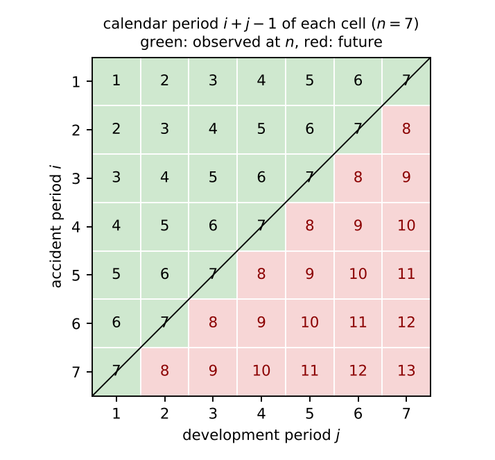

# Notation used in this document {-}

The symbols are those of the companion explainers *The mathematics behind the bCCNN* and *The fitting procedure and training of the bCCNN*; the ones in the lower block are new here. To avoid a clash with the ccODP intercept $c$, the valuation period of a partition (`origin`, `c0` in the code) is written $\tau$.

| Symbol | Meaning | Section |
|:--|:--|--:|
| $n$ | size of the triangle, $n = 20$ | 3 |
| $i, j, k$ | accident period, development period, calendar period $k = i + j - 1$ | 3 |
| $\mathcal{D}$ | the observed triangle at the valuation date $n$ (`sets$upper`), 210 cells | 3 |
| $\mathcal{F}$ | the future cells, $k > n$; never used here | 3 |
| $D(\boldsymbol y, \boldsymbol\mu; \mathcal{S})$ | Poisson deviance on the cells $\mathcal{S}$ | 7 |
| $\theta_0(\hat\vartheta)$, $\mathcal{T}^{s}_{t}(\theta, \mathcal{S})$ | the ccODP start built from a fit $\hat\vartheta$; $t$ RMSprop steps with seed $s$ on the cells $\mathcal{S}$ (companion on the fitting procedure, Section 11) | 6-8 |
| $T_{\max}$ | length of each early-stopping run, 1000 | 7 |
| | New in this document | |
| $\tau$ | valuation period of a partition: $\tau \in \{15, 18, 20\}$ | 4 |
| $t_1, t_2$ | calendar periods held out by the test partitions, `test_periods` $= (5, 2)$ | 4 |
| $v$ | validation calendar periods per partition, `vali_periods` $= 2$ | 4 |
| $e$ | first accident and development periods excluded from the validation diagonals, `exclude` $= 2$ | 4 |
| $\mathcal{D}_\tau$ | the triangle observed at $\tau$: the cells of the $\tau \times \tau$ square with $k \le \tau$ | 3 |
| $\mathcal{T}_\tau$ | test cells: cells of the $\tau \times \tau$ square with $\tau < k \le n$ | 3 |
| $\mathcal{V}_\tau, \mathcal{U}_\tau$ | validation and training cells of the partition, $\mathcal{U}_\tau = \mathcal{D}_\tau \setminus \mathcal{V}_\tau$ | 4 |
| $\mathcal{E}_\tau$ | the $K = v (e - 1)$ replacement validation cells at early development periods | 4 |
| $lo, hi$ | the range of accident periods the replacement cells are spread over | 4 |
| $\hat\vartheta(\mathcal{U}_\tau)$, $\hat\vartheta(\mathcal{D}_\tau)$ | ccODP fitted on the training cells; on all cells observed at $\tau$ (the chain ladder at $\tau$) | 6 |
| $D_{V,\tau}(t)$, $t^*_\tau$ | validation deviance of the partition after $t$ steps; its minimiser | 7 |
| $\bar D^{M}$ | test error of model $M$ over the test partitions, Al-Mudafer et al.'s eq. (4.4) | 9 |
| $t^*$ | the number of steps of the final fit, $t^* = t^*_{n}$ | 10 |

Abbreviations as in the companions. "Al-Mudafer et al." is Al-Mudafer, Avanzi, Taylor and Wong (2021), *Stochastic loss reserving with mixture density neural networks*, arXiv:2108.07924; the quotations are those of your hyperparameter notes (`thesis/Hyperparameter search`), which cite it by PDF page, and of the comments in `R/triangles.R`.

# What this document covers

`config.yml` sets `validation: rolling_origin`, so by default the number of gradient-descent steps of the bCCNN is not chosen on Paper C's split of the claims but on a split of the observed triangle along calendar time, after Al-Mudafer et al. This document defines that split cell by cell, proves the properties the code relies on, counts the cells for your configuration, and follows the three fits that are run on it: the early-stopping run on each partition, the out-of-time scoring of the test partitions, and the transfer of the chosen number of steps to the final fit. It ends with a comparison of what this split measures against what the claims split measures.

**How it was checked.** `rolling_origin_sets()` was re-implemented in Python from its definition (Section 4) for $n = 20$, `test_periods = c(5, 2)`, `vali_periods = 2`, `exclude = 2`, and the masks, counts, replacement cells and guarantees of Sections 4 and 5 were read off the result; Figure 2 is drawn from those masks. The counts agree with the closed forms (6)-(8) derived here.

# Why a split along time

The quantity the bCCNN predicts is the lower triangle: the payments of the calendar periods *after* the valuation date. A model is good if what it learned on calendar periods $\le n$ carries over to calendar periods $> n$. Three ways of building a validation signal differ in how closely they imitate that question:

* **A random hold-out of cells** of the same triangle measures interpolation between neighbouring cells. On a $20 \times 20$ triangle it is not even feasible for the ccODP start, which needs a cell in every accident and development period, and it is what Paper C ruled out for its 78-cell triangles.
* **The 50/50 split of the claims** (Paper C; companion on the fitting procedure, Section 3) measures how well the surface learned on one half of the portfolio fits an independent copy of the *same* upper triangle: the same accident periods, development periods and calendar periods. It is an out-of-sample signal, but not an out-of-time one.
* **The rolling origin** moves the valuation date back, fits on what would have been known then, and scores on the calendar periods that followed. This is the standard device of forecast evaluation (a "rolling forecasting origin", Tashman 2000; Hyndman and Athanasopoulos 2021, Section 5.10) and of reserving back-tests (removing the latest diagonals). Al-Mudafer et al. apply it to a $40 \times 40$ quarterly triangle: "In the first partition, the data is assumed to comprise a 30 x 30 triangle, which leaves the latest 10 calendar periods for the testing set. [...] The second partition works with a 36 x 36 triangle, leaving 4 calendar periods for testing" (§3.1), and the third partition is the whole triangle, on which the chosen model is trained. The two test partitions deliberately probe different horizons: the first "tests long-term projection", the second "recent trends" (comment in `R/triangles.R`).

In all three partitions the validation set, which stops the training, is also chosen by time: "the validation set included the 4 latest non-testing calendar periods, excluding the first 3 accident and development periods", so that "when combined with Early Stopping (see Section 4), the MDN stops training when short term projection accuracy is maximised" (§3.1). The code scales these numbers from $40 \times 40$ quarters to $20 \times 20$ years: test horizons $(5, 2)$ for their $(10, 4)$, $v = 2$ validation diagonals for their 4, and $e = 2$ excluded border periods for their 3.

# Calendar periods and the triangle observed at $\tau$

Cell $(i, j)$ belongs to calendar period $k = i + j - 1$; the cells of one calendar period form a diagonal of the square (Figure 1). At the valuation date $n$ the observed triangle is $\mathcal{D} = \{(i, j) : k \le n\}$.

{width=52%}

A reserving actuary working at the earlier valuation date $\tau < n$ would have seen accident periods $1, \dots, \tau$, development periods $1, \dots, \tau$, and only the cells with $k \le \tau$:

$$
\mathcal{D}_\tau = \{(i, j) : 1 \le i, j \le \tau, \ i + j - 1 \le \tau\}, \qquad |\mathcal{D}_\tau| = \frac{\tau (\tau + 1)}{2} . \tag{1}
$$

Any model fitted on $\mathcal{D}_\tau$ can forecast only cells of the $\tau \times \tau$ square: the ccODP has effects for the periods $\le \tau$ only, and so has the bCCNN, whose embeddings have $\tau$ categories. Of those cells, the ones that lie after $\tau$ but were observed by $n$ are the test cells of the partition,

$$
\begin{aligned}
\mathcal{T}_\tau &= \{(i, j) : 1 \le i, j \le \tau, \ \tau < i + j - 1 \le n\}, \\
|\mathcal{T}_\tau| &= \sum_{k = \tau + 1}^{n} (2\tau - k) \qquad (n \le 2\tau - 1),
\end{aligned} \tag{2}
$$

because diagonal $k \ge \tau$ of a $\tau \times \tau$ square holds the cells $i = k + 1 - \tau, \dots, \tau$, that is $2\tau - k$ of them. For $\tau = 15$: $14 + 13 + 12 + 11 + 10 = 60$ cells; for $\tau = 18$: $17 + 16 = 33$. The cells of $\mathcal{D}$ outside the $\tau \times \tau$ square (accident periods $> \tau$, or development periods $> \tau$) are observed but unused by that partition, and the true lower triangle $\mathcal{F}$ is used by no partition at all.

# The partitions

`rolling_origin_sets(m, test_periods = c(5, 2), vali_periods = 2, exclude = 2)` first cuts its input to the observed triangle, `y <- upper(m)`, so nothing below the diagonal $k = n$ can enter. It then builds one partition per valuation period

$$
\tau \in \{ n - t_1, \ n - t_2, \ n \} = \{15, 18, 20\}, \tag{3}
$$

test partitions first, the final one last. For each $\tau$ it takes the $\tau \times \tau$ square, computes $k$ for every cell, and defines:

**Validation cells.** The latest $v$ diagonals of $\mathcal{D}_\tau$, without the first $e$ accident periods and the first $e$ development periods,

$$
\mathcal{V}^{\mathrm{diag}}_\tau = \{(i, j) \in \mathcal{D}_\tau : \ k > \tau - v, \ i > e, \ j > e\}, \tag{4}
$$

plus $K = v (e - 1)$ replacement cells at the excluded early development periods (Al-Mudafer et al.: the "DQ2 and DQ3 validation points ... taken evenly from earlier AQs"). With $lo = e + 1$ and $hi = \tau - v - e + 1$, the replacement cells sit at development periods $e, e - 1, \dots, 2$ (cycled $K$ times; with $e = 2$ both at development period 2) and at the accident periods at the centres of $K$ equal bins of $[lo, hi]$,

$$
\begin{aligned}
\mathcal{E}_\tau &= \Big\{ (r_m, d_m) : \ r_m = \operatorname{round}\!\Big( lo + (hi - lo) \frac{m - \tfrac12}{K} \Big), \\
&\qquad\quad d_m = e - \big( (m - 1) \bmod (e - 1) \big), \ \ m = 1, \dots, K \Big\}, \\
\mathcal{V}_\tau &= \mathcal{V}^{\mathrm{diag}}_\tau \cup \mathcal{E}_\tau .
\end{aligned} \tag{5}
$$

(R's `round()` rounds halves to even, as the Python replication does.) For your configuration $K = 2$, $lo = 3$, and $hi = 12, 15, 17$ for $\tau = 15, 18, 20$, giving the replacement cells $(5, 2), (10, 2)$; $(6, 2), (12, 2)$; $(6, 2), (14, 2)$.

**Training cells.** Everything observed at $\tau$ that is not validation: $\mathcal{U}_\tau = \mathcal{D}_\tau \setminus \mathcal{V}_\tau$.

**Test cells.** $\mathcal{T}_\tau$ of (2) for the test partitions; none for the final partition ($\tau = n$).

Each partition is returned as a list with the $\tau \times \tau$ matrix of payments observed at $\tau$ (`y`, `NA` after $\tau$), the logical masks `train` and `vali`, the matrix `test` (payments on $\mathcal{T}_\tau$, `NA` elsewhere, `NULL` for the final partition), a `role` matrix for the plots, `origin` $= \tau$, `final`, and `n`. Figure 2 shows the three partitions; Table 1 counts their cells.

![The three partitions of the $20 \times 20$ triangle for `test_periods = c(5, 2)`, `vali_periods = 2`, `exclude = 2`: training cells (light green), validation cells (dark green: the last two diagonals of each partition minus the first two accident and development periods, plus two cells at development period 2), test cells (red: the calendar years after $\tau$ up to 20, inside the $\tau \times \tau$ square). Hatched: observed at year 20 but outside the partition's square. Grey: the true lower triangle, used by no partition.](figures/bccnn-explainers/rolling_origin_partitions.png){width=100%}

| partition | $\tau$ | square | $|\mathcal{D}_\tau|$ | training $|\mathcal{U}_\tau|$ | validation $|\mathcal{V}_\tau|$ (diagonals + $\mathcal{E}_\tau$) | validation cells by calendar period | test $|\mathcal{T}_\tau|$ (calendar periods) |
|:--|--:|:--|--:|--:|:--|:--|:--|
| test 1 | 15 | $15 \times 15$ | 120 | 97 | 23 (21 + 2) | $k = 14$: 10, $k = 15$: 11, $k = 6$: 1, $k = 11$: 1 | 60 ($k = 16, \dots, 20$) |
| test 2 | 18 | $18 \times 18$ | 171 | 142 | 29 (27 + 2) | $k = 17$: 13, $k = 18$: 14, $k = 7$: 1, $k = 13$: 1 | 33 ($k = 19, 20$) |
| final | 20 | $20 \times 20$ | 210 | 177 | 33 (31 + 2) | $k = 19$: 15, $k = 20$: 16, $k = 7$: 1, $k = 15$: 1 | none |

Table 1: Cells of the three partitions (Python replication of `rolling_origin_sets()`), before the masking of periods without payments (Section 7). The test partitions together hold 93 test cells.

# Properties of the split

**(a) Every accident period and every development period of $\mathcal{D}_\tau$ has a training cell.** Accident periods $i \le e$: none of their cells is on a validation diagonal (4), and the replacement rows satisfy $r_m \ge lo = e + 1$, so the whole row is training. Accident periods $i > e$: the cell $(i, 1)$ has $j = 1 \le e$, so it is excluded from (4), and the replacement cells have $d_m \ge 2$, so $(i, 1)$ is training. Development periods $j \le e$: the cell $(1, j)$ is in accident period $1 \le e$, hence training. Development periods $j > e$: the cell $(1, j)$ is in accident period 1, hence training. In short, the first $e$ rows and the first column are entirely training, and that is enough. This is the guarantee `fit_odp_glm(cells = part$train)` needs ("every accident and development period needs at least one cell to fit on") and the reason the comment in `R/triangles.R` says the exclusions make the ccODP start fittable on the training cells. The Python replication confirms it for all three partitions.

**(b) Counts.** Diagonal $k \le \tau$ of $\mathcal{D}_\tau$ has $k$ cells, $i = 1, \dots, k$; removing $i \le e$ and $j = k + 1 - i \le e$ removes $2e$ of them. Hence

$$
\begin{aligned}
|\mathcal{V}_\tau| &= \sum_{k = \tau - v + 1}^{\tau} (k - 2e) + v (e - 1) = v (\tau - 2e) - \frac{v (v - 1)}{2} + v (e - 1), \\
|\mathcal{U}_\tau| &= \frac{\tau (\tau + 1)}{2} - |\mathcal{V}_\tau| ,
\end{aligned} \tag{6}
$$

which gives $23, 29, 33$ validation cells and $97, 142, 177$ training cells for $\tau = 15, 18, 20$, as in Table 1. The validation share of the observed cells is $19.2\%$, $17.0\%$, $15.7\%$.

**(c) The latest accident periods and the latest development periods stay in training.** Accident period $\tau$ has the single cell $(\tau, 1)$, and accident period $\tau - 1$ the cells $(\tau - 1, 1), (\tau - 1, 2)$: all have $j \le e$ and are training. Likewise development periods $\tau$ and $\tau - 1$ consist of $(1, \tau)$ and $(1, \tau - 1), (2, \tau - 1)$, all in accident periods $\le e$, all training. So the network keeps learning the level of the most recent accident periods and the tail of the development pattern, while being stopped on the most recent diagonals of the periods in between. This is the point of Al-Mudafer et al.'s exclusion: without it, the latest accident period would have no training cell at all (its only cell is on the last diagonal), and a cross-classified model could not even be started.

**(d) The replacement cells lie off the validation diagonals.** A replacement cell has calendar period $r_m + d_m - 1 \le hi + e - 1 = \tau - v$, so it is earlier than every diagonal of (4): it adds validation information about the early development periods (which (4) removed) without touching the latest diagonals, and it is spread over the accident periods $[lo, hi]$ so as not to cluster. For the final partition the two cells are $(6, 2)$ and $(14, 2)$, calendar periods 7 and 15.

**(e) No leakage.** The input is cut to $\mathcal{D}$ before anything else, so the true lower triangle is in no partition. Within a partition, fitting and early stopping read only cells with $k \le \tau$; the cells with $\tau < k \le n$ are read by the scoring alone (Section 8), and only for the test partitions. The final partition's run tracks the true lower triangle (`truth`) for a plot, after the fact, without using it.

**(f) The partitions are nested in time, not in cells.** $\mathcal{D}_{15} \subset \mathcal{D}_{18} \subset \mathcal{D}_{20} = \mathcal{D}$, but the validation sets are not nested: the last two diagonals of the $15 \times 15$ triangle are training cells of the $18 \times 18$ one. Each partition is a complete, self-contained imitation of the reserving problem at its own valuation date.

**(g) Scaling.** Al-Mudafer et al.'s values $(10, 4) / 4 / 3$ on $40 \times 40$ quarters hold out $25\%$ and $10\%$ of the calendar periods for testing and $10\%$ for validation; the code's $(5, 2) / 2 / 2$ on $20 \times 20$ years keep the same proportions of calendar periods ($25\%$, $10\%$, $10\%$) and shrink the border from three periods to two. The function stops if a partition would be too small for the requested validation and border periods ($\tau - v < 2e + 1$).

# The ccODP start on the training cells

For each partition `bccnn_ro_partition()` fits the ccODP on the training cells only, `fit_odp_glm(part$y, cells = part$train)`, giving $\hat\vartheta(\mathcal{U}_\tau) = (\hat c, \hat\alpha_1, \dots, \hat\alpha_\tau, \hat\beta_1, \dots, \hat\beta_\tau)$ with $2\tau - 1$ parameters. The maximum likelihood equations of the companion (eq. (12) there) then hold over the training cells: the fitted row and column totals over $\mathcal{U}_\tau$ equal the observed ones over $\mathcal{U}_\tau$. Two consequences:

* The start of the partition's network is *not* the chain ladder of $\mathcal{D}_\tau$, which would use all of $\mathcal{D}_\tau$ including the validation diagonals. It is the ccODP of an irregular set of cells. The chain ladder at $\tau$, $\hat\vartheta(\mathcal{D}_\tau)$, is fitted separately for the scoring (`cl <- fit_odp_glm(part$y)`), so that the test partitions report two chain-ladder-type baselines: the chain ladder as it would have been reserved at $\tau$ (`test_ccODP`), and the training-cell ccODP that the network started from (`test_ccODP_train`, which is also the `test_pred` of the partition's history at step 0).
* Property 2 of the companion (zero gradient in $c$ and $w$ at the start, only $B$ moves at step 1) holds on the training cells, because it only needs the marginal-total equations on the cells the loss is computed on.

Unlike the claims split, the training cells carry the full volume of the portfolio, so $\hat c$ is on the scale of the whole triangle; what is removed is cells, not claims.

# The early-stopping run on a partition

Each partition then gets the run of the companion on the fitting procedure, Section 7, with its own data: from $\theta_0(\hat\vartheta(\mathcal{U}_\tau))$, $T_{\max} = 1000$ full-batch RMSprop steps on the $|\mathcal{U}_\tau|$ training cells with dropout, recording after every step the deviance without dropout on the training cells, on the validation cells,

$$
D_{V,\tau}(t) = D\big( \boldsymbol y, \ \boldsymbol\mu(\theta_t); \ \mathcal{V}_\tau \big), \qquad t = 0, \dots, T_{\max}, \tag{7}
$$

on the test cells $\mathcal{T}_\tau$ (test partitions; column `test`), and on the true lower triangle (final partition; column `truth`), together with the predicted sums over each of those sets (`*_pred`). The step with the lowest validation deviance,

$$
t^*_\tau = \arg\min_{0 \le t \le T_{\max}} D_{V,\tau}(t), \tag{8}
$$

the decreases `loss_decrease(h, best)` and the ccODP are kept. Because the partition's batch is its $|\mathcal{U}_\tau|$ training cells, each partition is a separate Keras model built with the same seed: the same initial hidden-layer weights, but, since the batch sizes differ, different dropout mask sequences. For the final partition the whole path of mean squares is kept (`keep_mu = TRUE` when `final_fit = "partition"`), so that its early-stopped network can be reported without retraining (Section 10).

**Periods without payments.** Property (a) guarantees each period a training *cell*, not a training *payment*. If all training cells of a development period hold zero, for instance a late development period whose only payment of the partition sits on a validation diagonal, the ccODP on the training cells gives that period an effect of about $-30$ and fitted means of order $e^{-30}$ (companion I, Section 3.9). A validation cell with a positive payment there would add about $30\,y$ to $D_{V,\tau}(t)$ at every step, and could decide $t^*_\tau$ by itself. `bccnn_ro_partition()` therefore applies `mask_zero_periods()` with the training-cell ccODP: those validation cells are left out of (7), as they are under the claims split, and $\mathcal{V}_\tau$ in (7)-(8) means the validation cells actually scored. Neither Al-Mudafer et al. nor Paper C nor Härkönen discuss this case.

# Scoring the test partitions out of time

A test partition answers: had the procedure been applied at valuation date $\tau$, how well would it have forecast the next $n - \tau$ calendar periods? `bccnn_ro_partition()` scores two things on $\mathcal{T}_\tau$, with `final_fit` deciding which network stands for the procedure:

* `final_fit = "refit"` (the default, Paper C's final fit): the procedure *as it is reported* is replayed at $\tau$. The chain ladder of $\mathcal{D}_\tau$ gives the start, and the network is trained on all of $\mathcal{D}_\tau$ for exactly $t^*_\tau$ steps,
  $$
  \begin{aligned}
  \theta^{\mathrm{refit}}_\tau &= \mathcal{T}^{s}_{t^*_\tau}\big( \theta_0(\hat\vartheta(\mathcal{D}_\tau)), \ \mathcal{D}_\tau \big), \\
  \text{test loss} &= D\big( \boldsymbol y, \ \boldsymbol\mu(\theta^{\mathrm{refit}}_\tau); \ \mathcal{T}_\tau \big), \qquad
  \text{test prediction} = \sum_{\mathcal{T}_\tau} \mu_{i,j}(\theta^{\mathrm{refit}}_\tau) .
  \end{aligned} \tag{9}
  $$
  This is a genuine out-of-time back-test of the whole chain "choose $t^*$ on the latest diagonals, refit on everything, forecast": every number in (9) could have been produced at $\tau$.
* `final_fit = "partition"` (Al-Mudafer et al.): the early-stopped network of the partition itself, $\theta_{t^*_\tau}$ trained on $\mathcal{U}_\tau$, is scored: the test loss and test prediction are read from the history at step $t^*_\tau$.

Test cells get the same treatment with a different reference. A test cell is left out if its accident or development period has no payments in *any* cell observed at $\tau$, that is, if the chain ladder at $\tau$ flags it: no model fitted at $\tau$ could forecast it. A test cell in a period that has payments only in the validation cells stays in. The chain ladder at $\tau$ does know that period, so a variant that loses it, such as the `partition` network started from the training-cell ccODP, is scored for the loss. All three models are scored on the same test cells, and `n_test` counts them.

Next to the bCCNN, the partition records the actual test sum $\sum_{\mathcal{T}_\tau} y_{i,j}$, the chain ladder at $\tau$ (its test sum and test deviance) and the training-cell ccODP (its test sum and test deviance from the history at step 0). The code's comment names which baseline is like-for-like with which variant: the chain ladder at $\tau$ for `refit`, the training-cell ccODP for `partition`.

# The test error (Al-Mudafer et al., eq. (4.4))

`bccnn_rolling_origin()` pools the test partitions into one number per model: the test deviance per test cell,

$$
\begin{aligned}
\bar D^{M} &= \frac{ \sum_{\tau \in \{15, 18\}} D\big( \boldsymbol y, \boldsymbol\mu^{M}_\tau; \mathcal{T}_\tau \big) }{ \sum_{\tau \in \{15, 18\}} |\mathcal{T}_\tau| }, \\
M &\in \{\text{ccODP (chain ladder at } \tau), \ \text{ccODP on } \mathcal{U}_\tau, \ \text{bCCNN}\},
\end{aligned} \tag{10}
$$

with $60 + 33 = 93$ test cells in the denominator (fewer if a test partition has a period without payments by $\tau$, Section 8). It is cell-weighted, so the long-horizon partition ($\tau = 15$, five calendar years ahead) weighs almost twice the short-horizon one; Al-Mudafer et al.'s (4.4) averages the negative log-likelihood of their density forecasts in the same way, and the code uses the deviance because the bCCNN is a mean model. `bccnn_tables()` prints the per-partition losses, their per-cell versions, and the pooled row labelled "test error (4.4)".

What the test error is for. In Al-Mudafer et al. it is the objective of the hyperparameter search ("The MDN's architecture was selected using an algorithm that successively optimised one hyper-parameter at a time", §3.2), averaged over several seeds to damp the initialisation. In the code the architecture is fixed by `config.yml`, so $\bar D$ is *reported*, not optimised: it tells you whether the bCCNN procedure beat the chain ladder out of time at two earlier valuation dates, in the same units as the in-sample and out-of-sample deviances of the final fit, before the true lower triangle is looked at. It is a single realisation per seed (the comment in `bccnn_rolling_origin()`: "the results depend on the seed"); comparing designs by it would need the seed averaging Al-Mudafer et al. do.

# From the final partition to the reported model

The number of steps of the final fit is the final partition's,

$$
\begin{aligned}
t^* &= t^*_{n}, \qquad \text{chosen on } \mathcal{V}_{20}: \\
&\text{the diagonals } k = 19, 20 \text{ minus the border, plus } (6, 2), (14, 2) .
\end{aligned} \tag{11}
$$

`bccnn_calibrate()` then proceeds exactly as under the claims split (companion on the fitting procedure, Sections 8 and 9): under `refit`, the chain ladder of $\mathcal{D}$ is fitted and the network is trained on all 210 cells for $t^*$ steps from it, $\hat\theta = \mathcal{T}^{s}_{t^*}(\theta_0(\hat\vartheta(\mathcal{D})), \mathcal{D})$; under `partition`, the mean square of the final partition's network at step $t^*$ is taken from the stored path, with no second training. The decreases of Paper C's Table 3 and the bCCNN dispersion $\hat\phi^{\mathrm{bCCNN}} = \hat\phi_D (1 - \max(0, \Delta_V))$ are computed from the final partition's curve, so $\Delta_V$ is now the relative decrease of the deviance on the latest two diagonals rather than on an independent half of the portfolio.

The transfer of $t^*$ rests on the same assumption as under the claims split, that the loss surface of the full triangle is close to the one the run explored, and it is a milder assumption here in one respect and a stronger one in another. Milder, because the training cells of the final partition are 177 of the 210 cells of the same portfolio, with the same intercept scale, rather than half the claims. Stronger, because the 33 cells that the refit adds are the latest diagonals, the cells nearest to the forecast region, and the refit trains on them for $t^*$ steps without any check on them.

# What the two validation signals measure

| | claims split (Paper C, Härkönen) | rolling origin (Al-Mudafer et al.) |
|:--|:--|:--|
| what is split | the individual claims, into two portfolios | the cells of the observed triangle, by calendar period |
| training data of the run | the training half's upper triangle, 210 cells, half the volume | the training cells $\mathcal{U}_\tau$: 177 of 210 cells (final partition), full volume |
| validation data | the validation half's upper triangle, 210 cells (minus zero periods): the same $(i, j)$ pairs as training | the latest two diagonals minus the border, plus two early cells: 33 cells, $(i, j)$ pairs the run never trained on |
| what $D_V$ estimates | out-of-sample fit at the same accident, development and calendar periods: interpolation in an independent copy | out-of-sample fit one and two calendar periods ahead of the training cells: short-term extrapolation |
| start of the run | ccODP of the training half (intercept lower by about $\log 2$) | ccODP of the training cells (not the chain ladder of the partition) |
| out-of-time check before the truth is used | none | the test error (10) at two earlier valuation dates |
| randomness in the split | the allocation of the claims (Härkönen: results change when the halves are swapped) | none: the split is deterministic given the configuration |
| what is transferred to the final fit | $t^*$ | $t^*$ of the final partition (or the partition's network itself) |
| cost | one ccODP, one run | three ccODPs and three runs, plus two refits for the scoring |

Table 2: The two early-stopping signals available in `config.yml`.

Neither signal measures what the back-test measures, the deviance on the true lower triangle, which is 190 cells up to 19 calendar periods ahead; the rolling origin's test partition 1 (five periods ahead) is the closest a procedure can get without looking at the truth. For a short-tailed annual triangle, where most of the reserve sits in the first few development periods of the latest accident periods, "short-term projection accuracy" is also most of the reserve, which is the case for stopping on the latest diagonals.

# Where each step is in the code

| step | where |
|:--|:--|
| cut to the observed triangle; calendar periods (1) | `rolling_origin_sets()`: `y <- upper(unname(as.matrix(m)))`, `cal <- row(ys) + col(ys) - 1L`, `known <- cal <= c0` |
| valuation periods (3) | `origins <- c(n - sort(test_periods, decreasing = TRUE), n)` |
| validation diagonals (4) | `vali <- known & cal > c0 - vali_periods & row(ys) > exclude & col(ys) > exclude` |
| replacement cells (5) | `k <- vali_periods * (exclude - 1L)`, `lo <- exclude + 1`, `hi <- c0 - vali_periods - exclude + 1`, `rows <- round(lo + (hi - lo) * (seq_len(k) - 0.5) / k)`, `devs <- rep(exclude:2, length.out = k)`, `vali[cbind(rows, devs)] <- TRUE` |
| training and test cells, (2) | `train <- known & !vali`; `test <- if (c0 < n) ifelse(cal > c0, ys, NA) else NULL` (the `NA`s of `ys` beyond $k = n$ keep the test inside $\mathcal{D}$) |
| size check, property (g) | `if (any(origins - vali_periods < 2 * exclude + 1)) stop(...)` |
| ccODP on the training cells, Section 6 | `bccnn_ro_partition()`: `odp <- fit_odp_glm(part$y, scale, phi, cells = part$train)`; `cl <- fit_odp_glm(part$y, ...)` for the chain ladder at $\tau$ |
| masking of periods without payments, Sections 7-8 | `bccnn_ro_partition()`: `cl <- fit_odp_glm(part$y, ...)` first, then `track$vali <- mask_zero_periods(ifelse(part$vali, odp$y, NA), odp)`, `track$test <- mask_zero_periods(part$test / scale, cl)`; `n_vali`, `n_test` count the scored cells |
| the run (7)-(8) | `nn <- fit_bccnn(odp, epochs = max_epochs, track = track, keep_mu = keep_mu)`, `best <- h$epoch[which.min(h$vali)]` |
| scoring (9) | `if (final_fit == "refit") rf <- fit_bccnn(cl, epochs = best, track = list(test = track$test))` else `at("test", best)`; the `out$test` vector |
| test error (10) | `bccnn_rolling_origin()`: `test_error <- c(ccODP = ..., ccODP_train = ..., bCCNN = ...) / sum(tst$n_test)`; `bccnn_tables()` row "test error (4.4)" |
| final partition to the final fit (11) | `bccnn_calibrate()`: `val <- ro$final`, `steps <- val$best_epoch`, then `fit_bccnn(odp, epochs = steps, ...)` or `val$mu_path[[steps + 1]]` |
| figures | `plot_partition(part)` in `R/plots.R` (roles as tiles), called per partition by the script |

# Numerical check

The Python replication (`rolling_origin_check.py`, kept with these explainers) reproduces Table 1 and the properties of Section 5 for your configuration:

| check | result |
|:--|:--|
| valuation periods (3) | $15, 18, 20$ |
| cells observed at $\tau$, (1) | $120, 171, 210$ |
| validation cells, (6): on the diagonals + replacements | $21 + 2, \ 27 + 2, \ 31 + 2$ |
| replacement cells (5): $(lo, hi)$ and the cells | $(3, 12): (5, 2), (10, 2)$; $(3, 15): (6, 2), (12, 2)$; $(3, 17): (6, 2), (14, 2)$; calendar periods $6, 11; \ 7, 13; \ 7, 15$, all $\le \tau - v$ |
| training cells | $97, 142, 177$; in the last two accident periods of each partition: $1$ and $2$ cells, all training |
| every accident period and every development period has a training cell, (a) | true, true, true |
| test cells (2) and their calendar periods | $60$ ($k = 16$ to $20$), $33$ ($k = 19, 20$), none; $93$ in total |
| validation share of the observed cells | $19.2\%, 17.0\%, 15.7\%$ |

Table 3: Replication of `rolling_origin_sets()` for `test_periods = c(5, 2)`, `vali_periods = 2`, `exclude = 2`, $n = 20$.

# References {-}

Al-Mudafer, M. T., Avanzi, B., Taylor, G. and Wong, B. (2021). Stochastic loss reserving with mixture density neural networks. arXiv:2108.07924.

Gabrielli, A., Richman, R. and Wüthrich, M. V. (2020). Neural network embedding of the over-dispersed Poisson reserving model. Scandinavian Actuarial Journal 2020(1):1-29.

Härkönen, V. (2021). On claims reserving with machine learning techniques. Master thesis 2021:4, Mathematical Statistics, Stockholm University.

Hyndman, R. J. and Athanasopoulos, G. (2021). Forecasting: Principles and Practice, 3rd ed. OTexts. Section 5.10, time series cross-validation.

Tashman, L. J. (2000). Out-of-sample tests of forecasting accuracy: an analysis and review. International Journal of Forecasting 16(4):437-450.
